# ブラウザ YouTube ライブ配信（MVP）仕様書

リポジトリ名：**`browser-youtube-live-mvp`**

---

## 1. 概要

### 1.1 課題

配信ソフト（OBS 等）をインストールせず、**ブラウザのタブを開くだけ**で、カメラ・マイク・画面共有を合成した映像を自分の YouTube チャンネルへライブ配信する。

この課題には 2 つの断絶がある。

- ブラウザは RTMP を話せない（生の TCP ソケットを持たない）
- YouTube が受け付ける取り込み方式は RTMP（RTMPS）・HLS・DASH であり、いずれもエンコーダ機器・ソフトを前提とする。ブラウザから直接到達できる公式の受け口は存在しない

本成果物は、この断絶を **ブラウザ側エンコード ＋ 中継サーバーによる容器の詰め替え（再エンコードなし）＋ YouTube の配信資源の自動管理** で埋める。利用者は配信キーを扱わず、YouTube を一度接続すれば「配信開始」の操作だけで配信が成立する。

### 1.2 対象エディション

**MVP（需要調査）**

| 軸 | 実施 | 本成果物での内容 |
|---|---|---|
| デザイン | あり | 配色・レイアウト・状態表示を定義する（17 章） |
| 測定 | あり | 利用状況の計測軸とイベントを定義する（18 章） |
| 保守 | なし | リリース後の不具合対応・機能改修の体制を持たない |
| 監視 | なし | 稼働監視・アラート通知を持たない |

### 1.3 提供価値

| 価値 | 内容 |
|---|---|
| インストール不要 | 対応ブラウザでページを開けば配信できる |
| 配信キー不要 | 配信枠・配信キー・紐づけをシステムが自動で用意する。利用者は配信キーを見ることも貼ることもない |
| 1 画面で完結 | ソースの準備・プレビュー・開始・健全性の確認・停止を 1 画面で行う |
| 放置しても閉じる | タブを閉じた・回線が切れた場合も、配信が YouTube 上に残り続けない |

### 1.4 需要検証の問い

「配信ソフトを使わずブラウザだけで YouTube へ配信したい人が存在し、繰り返し使うか」を検証する。検証に用いる計測軸は 18 章に定める。

---

## 2. プラットフォーム選定と構成

### 2.1 ターゲットの判別

成果物を直接操作するのは**人間**（配信者）である。よってターゲットは人間向けとする。

### 2.2 プラットフォーム

**ウェブ** を選択する。

- 「ブラウザから」という要件が課題そのものであり、インストール不要であることが提供価値の中核である
- メディア取得・画面共有・エンコードの API はブラウザに存在し、それらを用いることが解決手段そのものである
- 利用者の操作（ソース選択・開始・停止）に応じて出力が変わるため、電子書籍・動画は該当しない

### 2.3 技術構成

| 層 | 技術 | デプロイ先 | 役割 |
|---|---|---|---|
| フロントエンド | Next.js（TypeScript） | Vercel（無料） | スタジオ画面・案内ページ。ブラウザから見た HTTP の唯一の相手として、アプリケーション層への要求を同一オリジンで中継する |
| アプリケーション | Rails（Ruby） | Railway（無料） | 認証・YouTube 連携・利用制限・配信レコード・定期ジョブ・開発者用管理画面 |
| 中継 | Gin（Go） | Railway（無料） | WebSocket 受信・FLV 多重化・RTMPS 送出 |
| DB | PostgreSQL | Railway（無料） | アプリケーション層のみが接続する |

- 中継層を Go とするのは、1 接続あたり毎秒数十のメディアフレームを低遅延で捌く実時間通信であり、高速並列処理・リアルタイム通信の要件に該当するためである
- 中継層は状態を永続化しない。配信の正はアプリケーション層の配信レコードとする
- Railway が利用できない場合に限り Render を用いる

### 2.4 AI 機能・分類器

AI 機能を持たない。よって LangChain・LangSmith は使用しない。

本設計に含まれる判定（開始受付・プロファイル選定・適応制御・状態遷移）は、いずれも数値・日付・状態に対する決定的な規則であり、自然言語や曖昧な入力に対する分類・振り分けを含まない。よって分類器（Jev）は該当しない。

AI 利用に適用する「アカウントごとに 1 日 1 回（JST 03:00 自動リセット・開発者が手動リセット可能）」の利用枠は、本成果物で費用と上限を伴う唯一の資源である**配信**に適用する（8 章）。

### 2.5 Domain Core の分離

ビジネスロジックを GUI・HTTP・WebSocket の各インターフェースから分離する。

| 配置 | Domain Core | アダプタ |
|---|---|---|
| ブラウザ | 配信パイプライン（ソース管理・合成・クロック・エンコード・送信制御・状態機械） | React の画面部品 |
| アプリケーション | 受付判定・利用枠・割り当て台帳・配信の状態遷移・清算 | HTTP コントローラ・管理画面・定期ジョブ・YouTube API クライアント |
| 中継 | 取り込みセッション・多重化・時刻再基準化 | WebSocket ハンドラ・RTMPS クライアント |

Core は特定のインターフェースの型（要求・応答・画面部品）を参照しない。

### 2.6 リポジトリ構成

```text
browser-youtube-live-mvp/
├── src/
│   ├── frontend/        Next.js（app/ 等の既定ディレクトリはこの内側）
│   │   └── core/        配信パイプラインの Domain Core
│   ├── backend/         Rails（app/ 等の既定ディレクトリはこの内側）
│   │   └── app/domain/  Domain Core
│   └── relay/           Go（Gin）
│       └── core/        Domain Core
├── test/                層別のテスト
└── .github/             CI 設定
```

---

## 3. 外部仕様の前提

本仕様が依拠する外部仕様と、その参照日を示す。参照日はいずれも **2026-10-06** である。

| 項目 | 前提とする内容 | 出典 |
|---|---|---|
| YouTube の取り込み方式 | ライブストリームの取り込み種別は `rtmp`（RTMPS を含む）・`hls`・`dash` | https://developers.google.com/youtube/v3/live/docs/liveStreams |
| HLS 取り込み | M2TS セグメントとプレイリストを HTTP PUT / POST で送る方式。送信元の機器名を示すヘッダの指定を求めており、ブラウザからの送出を想定した記載はない | https://developers.google.com/youtube/v3/live/guides/hls-ingestion |
| エンコード設定 | 映像 H.264 等。キーフレーム間隔は 2 秒を推奨、4 秒を超えない。音声は AAC または MP3、ステレオは 44.1 kHz・128 kbps。720p/30fps は最小 3 Mbps・推奨 8 Mbps、480p/30fps は最小 0.4 Mbps・推奨 4 Mbps。固定ビットレート | https://support.google.com/youtube/answer/2853702 |
| 配信の自動開始・自動停止 | 紐づけたストリームへの送出開始で配信が自動開始し、送出停止からおよそ 1 分後に自動停止する設定がある | https://developers.google.com/youtube/v3/live/docs/liveBroadcasts |
| 配信作成の必須項目とエラー | タイトル・開始予定時刻・公開範囲が必須。ライブ未有効・配信数超過等のエラーが定義されている | https://developers.google.com/youtube/v3/live/docs/liveBroadcasts/insert |
| API の割り当て | 既定は 1 日 10,000 ユニット（一部メソッドは別枠）。太平洋時間 0 時にリセット。配信・ストリームの作成・更新・紐づけ・遷移・削除は各 50、一覧取得は 1 | https://developers.google.com/youtube/v3/determine_quota_cost |
| 認可スコープ | 配信の作成・紐づけ・遷移は `youtube` または `youtube.force-ssl` を要する | https://developers.google.com/youtube/v3/live/docs/liveBroadcasts/insert |
| OAuth の公開ステータス | テスト状態は登録 100 人まで・同意から 7 日で失効。本番状態で機微スコープが未審査の場合、新規利用者は累計 100 人まで | https://support.google.com/cloud/answer/15549945 |
| YouTube API サービス開発者ポリシー | 利用規約・プライバシーポリシーへの必須記載。認可データを 30 日を超えて保持する場合は更新または消去を要する。削除の要求には 7 日以内に応じる | https://developers.google.com/youtube/terms/developer-policies |
| ライブ配信の有効化 | チャンネルの確認と、過去 90 日に配信制限がないことを要する。配信者は 16 歳以上 | https://support.google.com/youtube/answer/2474026 |
| ブラウザ内エンコード | WebCodecs は Chrome・Edge 94 以降、Firefox 130 以降、Safari 26 以降が対応 | https://caniuse.com/webcodecs |
| Railway 無料プラン | 月 1 ドル分の利用枠、サービスあたり RAM 0.5 GB・1 vCPU・ボリューム 0.5 GB。残高ゼロで全ワークロードが停止する。従量の単価は RAM 1 GB あたり月 10 ドル、1 vCPU あたり月 20 ドル、送信転送量 1 GB あたり 0.05 ドル | https://docs.railway.com/pricing/plans |
| Vercel Hobby プラン | 非商用・個人利用に限る。上限超過時は当該機能が停止する。Web Analytics は月 50,000 イベント | https://vercel.com/docs/plans/hobby |
| reCAPTCHA | Essentials は月 10,000 評価まで無料 | https://docs.cloud.google.com/recaptcha/docs/compare-tiers |

---

## 4. 用語定義

| 用語 | 定義 |
|---|---|
| ソース | 配信に取り込む入力。カメラ・マイク・画面共有・共有音声の 4 種と、内部生成の代替スレート |
| 代替スレート | 映像ソースが 1 つも無いときに合成する静止の代替映像 |
| ワイプ | 主映像の上に重ねる小窓映像 |
| メディアクロック | 音声の累積サンプル数を基準とする単調増加の時刻。実時計から独立する |
| プロファイル | 解像度・フレームレート・ビットレート範囲の組。1 配信につき 1 つを開始時に確定する |
| 滞留時間 | 送信済みの最新メディア時刻と、中継が受領済みと応答した最新メディア時刻（映像・音声のうち古い方）の差 |
| 配信レコード | アプリケーション層が保持する配信 1 本の記録。配信の状態の正 |
| YouTube 資源 | YouTube 側の配信（broadcast）とストリーム（stream）、およびその紐づけ |
| 清算 | 終了した配信の YouTube 資源を終端（完了または削除）へ導くこと |
| 利用日 | JST 03:00 を区切りとする 1 日。時刻から 3 時間を引いた JST の日付 |
| 割り当て日 | YouTube API の割り当てがリセットされる単位。太平洋時間の日付 |
| 接続チケット | 中継への WebSocket 接続を 1 回だけ許可する、短命で推測不可能な識別子 |
| 送出世代 | 配信レコードごとの連番。接続チケットの受理のたびに増え、最新の世代のみが送出できる |
| 中断 | ライブ確定後に、中継へメディアが届かなくなった状態 |

---

## 5. スコープ

### 5.1 対象

- Google アカウントでのログインと、YouTube チャンネルの接続・解除
- カメラ・マイク・画面共有・共有音声の取得と合成、プレビュー
- ブラウザ側での H.264 / AAC エンコードと、中継サーバーへの転送
- YouTube の配信資源の自動作成・紐づけ・終了・清算
- 回線に応じたプロファイル選定とビットレート適応
- ソース喪失・接続断・放置に対する継続・復帰・自動終了
- 利用制限（日次利用枠・試行上限・同時配信数・時間上限・受付要求の頻度・月次の送信転送量の予算・API 割り当て）
- 利用状況の計測、開発者用管理画面

### 5.2 対象外

- 配信の予約、複数の配信先への同時送出、YouTube 以外への送出
- チャット・コメントの表示と投稿、視聴者数の表示
- 録画ファイルの保存・ダウンロード（アーカイブは YouTube 側の機能に委ねる）
- テロップ・画像・BGM 等の素材合成、レイアウトの手動編集
- 配信中の解像度・プロファイルの変更
- 説明文・サムネイル・カテゴリ等、タイトル・公開範囲・子ども向け申告以外の配信設定
- 課金・収益化に関する機能
- 中継層での再エンコード

---

## 6. システム構成

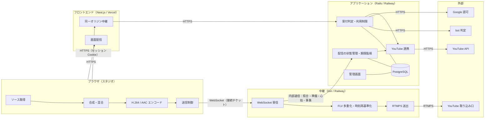
```mermaid
flowchart LR
  subgraph BR["ブラウザ（スタジオ）"]
    SRC["ソース取得"]
    CMP["合成・混合"]
    ENC["H.264 / AAC エンコード"]
    TX["送信制御"]
  end

  subgraph FE["フロントエンド（Next.js / Vercel）"]
    UI["画面配信"]
    BFF["同一オリジン中継"]
  end

  subgraph APP["アプリケーション（Rails / Railway）"]
    ADM["受付判定・利用制限"]
    LIFE["配信の状態管理・期限監視"]
    YTG["YouTube 連携"]
    MGT["管理画面"]
    DB[("PostgreSQL")]
  end

  subgraph RLY["中継（Gin / Railway）"]
    WS["WebSocket 受信"]
    MUX["FLV 多重化・時刻再基準化"]
    PUB["RTMPS 送出"]
  end

  subgraph EXT["外部"]
    GID["Google 認可"]
    BOT["bot 判定"]
    YAPI["YouTube API"]
    YING["YouTube 取り込み口"]
  end

  SRC --> CMP --> ENC --> TX
  BR -->|"HTTPS"| UI
  BR -->|"HTTPS（セッション Cookie）"| BFF
  BFF -->|"HTTPS"| ADM
  TX -->|"WebSocket（接続チケット）"| WS
  WS --> MUX --> PUB
  PUB -->|"RTMPS"| YING
  WS -->|"内部通信：照合・準備・心拍・事象"| LIFE
  ADM --- DB
  LIFE --- DB
  YTG -->|"HTTPS"| YAPI
  ADM -->|"HTTPS"| BOT
  ADM -->|"HTTPS"| GID
  ADM --> YTG
  LIFE --> YTG
  MGT --- DB
```

### 6.1 通信経路の原則

| 経路 | 方式 | 原則 |
|---|---|---|
| ブラウザ → フロントエンド → アプリケーション | HTTPS | ブラウザから見た HTTP の相手はフロントエンドのオリジンのみとする。セッション Cookie は第一者 Cookie として成立させる。アプリケーションは、フロントエンドからの要求であることを共有の秘密値で確認する |
| ブラウザ → 中継 | WebSocket（TLS） | Cookie に依存しない。接続チケットで認可する |
| 中継 → アプリケーション | 内部通信 | 呼び出しは中継からアプリケーションへの一方向とする。アプリケーションから中継への指示は、心拍の応答に載せて返す。内部通信の口は公開側の受け口と分け、外部から到達できない経路でのみ受け付ける |
| 中継 → YouTube 取り込み口 | RTMPS | 平文の RTMP を用いない |
| アプリケーション → YouTube API | HTTPS | すべての呼び出しを単一の窓口に通し、割り当て台帳へ記帳する |

**要件**

- 配信キーと取り込み先は、アプリケーションから中継へ内部通信でのみ渡す。ブラウザへ送らない
- データ面（メディアの転送）は、制御面（アプリケーション層）の 60 秒以内の不達で停止しないこと。中継は事象を保持して再送する
- 心拍の応答が 60 秒得られない取り込みセッションは、中継が自ら送出を止めて閉じる。時間上限・停止の指示・送出世代の確認が効かない状態で送出を続けない
- 制御面は中継の不達で停止しないこと。配信レコードの各状態は期限を持ち、中継からの通知が無くても期限監視によって終端へ進む

---

## 7. 認証・認可仕様

### 7.1 ログイン

- 認証は Google ログイン（OpenID Connect の認可コードフロー ＋ PKCE）とする
- ログイン時に要求するスコープは `openid` のみとする。メールアドレス・プロフィールを要求しない
- 利用者の識別子として、ID トークンの `sub` のみを保持する
- セッションはサーバー側に保持し、ブラウザには識別子のみを HttpOnly・Secure・SameSite=Lax の Cookie で渡す
- ログイン開始の操作に bot 判定（reCAPTCHA）を課す
- 再登録の保留中（7.4）の Google アカウントでログインした場合、アカウントを作成せず、次の利用日から利用できる旨を表示する

### 7.2 YouTube 接続

ログインと YouTube 接続を分離し、YouTube の権限は利用者が「YouTube を接続」を操作した時点で初めて要求する（段階的な認可）。接続前でも、ソースの準備とプレビューは利用できる。

| 項目 | 仕様 |
|---|---|
| 要求スコープ | `https://www.googleapis.com/auth/youtube` の 1 種のみ |
| アクセス種別 | オフライン（更新トークンを受け取る） |
| 同意の強制 | 接続のたびに同意画面を表示し、更新トークンの発行を確実にする |
| アカウントの案内 | 認可要求に、ログイン中の Google アカウントを優先して提示させる指定を付ける。接続先のチャンネルは、同意画面で利用者が選んだものとする |
| スコープの部分拒否 | 利用者が YouTube の権限を外して同意した場合、接続を成立させず、権限が必要な理由を表示する |
| 更新トークンの欠落 | 応答に更新トークンが無い場合、接続を成立させず、再接続を案内する |
| 接続時の確認 | チャンネルの有無と、ライブ配信が有効かを、各 1 ユニットの一覧取得で確認する。ライブ配信が有効かは、配信の一覧取得がライブ未有効のエラーを返すか否かで判定する |
| 不成立時のトークン | 接続が成立しなかった場合（権限の部分拒否・更新トークンの欠落・チャンネルなし・確認不能）、受け取ったトークンを保存せず破棄する。既存の接続が無い場合に限り、Google 側でも失効させる |
| 接続成立時のストリーム | 接続の成立のたびに、保存済みの配信用ストリームの識別子を破棄する（10.5） |
| 確認の頻度 | 「再確認」はアカウントごとに 1 分に 1 回、1 日 20 回までとする。チャンネル名は取得から最長 10 分間メモリに保持して再取得を省き、永続化しない |
| チャンネルの選択 | 複数チャンネルを持つ場合の選択は Google の同意画面で行われる。切り替えは再接続で行う |

**接続時の確認の結果**

| 結果 | 接続状態 | 画面の案内 |
|---|---|---|
| チャンネルあり・ライブ有効 | 接続済み | 配信開始を有効にする |
| チャンネルなし | 未接続のまま | YouTube でチャンネルを作成するよう案内する |
| ライブ未有効 | ライブ未有効 | YouTube 側でライブ配信を有効にする手順と、有効化に時間を要する場合がある旨を案内する。「再確認」の操作を置く |
| 確認不能（共通枠の枯渇・一時的な失敗） | 変更しない | 確認できなかった旨と、時間を置いた再試行を案内する |

### 7.3 トークンの取り扱い

- 更新トークンはアプリケーション層で暗号化して保存する。暗号鍵は環境変数で外部化する
- アクセストークンは必要時に更新トークンから取得し、有効期限内に限りメモリ上で再利用する。永続化しない
- トークンをブラウザ・中継・ログ・測定イベント・管理画面へ出力しない
- トークンの用途は、利用者が同意した目的（本人のチャンネルでのライブ配信の作成・確認・終了・清算）に限る
- 更新が恒久的に失敗した場合（認可の取り消し等）、接続状態を「認可失効」とし、再接続を案内する

### 7.4 接続解除とアカウント削除

| 操作 | 動作 |
|---|---|
| YouTube 接続の解除 | 未清算の配信の清算を試みたうえで、Google 側でトークンを失効させ、保存したトークンとストリーム識別子を削除する。YouTube 側のストリームは削除しない |
| アカウント削除 | 接続の解除に加え、当該アカウントに紐づく全レコードを削除する。測定イベントと割り当ての記帳の明細は、アカウント・配信との紐づけを外す |

- 進行中の配信がある間は、解除・削除・再接続を受け付けず、先に停止するよう案内する
- 解除・削除の時点で行う清算の試行は、清算の再試行の 1 回として数える。削除する配信の予約の残額は、削除と同時に解放する
- 削除は要求の受理と同時に実行する。未清算の配信を清算できない場合も、削除は実行する
- 削除したアカウントの Google 識別子の要約値を、削除時点の利用日の終わりまで保持し、その間は同じ Google アカウントでの再登録を受け付けない（削除と再登録の繰り返しによる利用枠の再取得を防ぐ）。利用日の終わりに要約値を消去する

---

## 8. 利用制限仕様

制限値はいずれも設定値であり、管理画面から変更できる（19 章）。

| 制限 | 既定値 | 単位・区切り | 計上の時点 |
|---|---|---|---|
| 配信の日次利用枠 | 1 回 | アカウント × 利用日 | YouTube 上でライブが確定した時点 |
| 開始試行 | 3 回 | アカウント × 利用日 | YouTube 資源の作成に進んだ時点 |
| 同時配信数 | 3 本 | システム全体 | 受理から終了まで |
| 1 配信の時間上限 | 60 分 | 配信 1 本 | ライブ確定からの経過 |
| 受付要求の頻度 | 10 回 / 時 | アカウント | 受付要求の到着 |
| 月次の送信転送量の予算 | 10 GB | システム全体 × 暦月（JST） | 中継の送出量の報告ごと |
| YouTube API の割り当て | 10,000 ユニット | システム全体 × 割り当て日 | API 呼び出しごと |
| bot 判定のスコアの閾値 | 0.5（仮置き。reCAPTCHA v3 で一般に目安とされる値。運用で実測してから見直す） | 0〜1 のスコア。システム全体 | ログイン開始・YouTube 接続開始・配信の開始要求の検証 |

IP 単位の頻度制限（28.1）は固定値とし、設定値に含めない。

### 8.1 日次利用枠

- 利用枠の判定と消費は、**受付を受理した時刻の利用日**に紐づける。配信が JST 03:00 をまたいでも、消費先は受理時の利用日とし、配信は中断しない
- 消費はライブが確定した時点で行う。確定前に終了した配信（準備の失敗・タイムアウト・取り消し）は利用枠を消費しない
- JST 03:00 のリセットは、定期ジョブではなく利用日の算出規則によって成立させる。ジョブの失敗がリセットの失敗にならないこと
- 開発者は管理画面から、特定アカウントの当該利用日の利用枠を手動でリセットできる。リセットは追加の 1 回を付与し、開始試行の計数を 0 に戻す
- 利用枠を消費済みの場合、次に開始できる時刻（次の JST 03:00）を画面に表示する

### 8.2 開始試行

- 利用枠を消費しない失敗が、YouTube API の割り当てを消費し続けることを防ぐための上限である
- YouTube 資源の作成に進む前に終了した試行（回線不足・接続の不成立・取り消し）は計上しない

### 8.3 同時配信数と時間上限

- 同時配信数は中継層の無料枠の資源に対する上限である。上限到達時は新規の受付を拒否し、待ち行列を持たない
- 時間上限の 5 分前に画面で予告し、上限到達時に配信を終了する（終了理由：時間上限）
- 月次の送信転送量の予算は、無料枠の利用枠を配信の転送量が使い切ることを防ぐための上限である（29.2）。中継が報告する送出量を暦月ごとに積算し、予算に達した月は新規の受付を拒否する。進行中の配信は継続するため、積算は受付の判定後に進行中の配信が送出する分だけ予算を上回り得る

### 8.4 YouTube API の割り当て台帳

| 項目 | 値 |
|---|---|
| 1 日の割り当て | 10,000 ユニット |
| 共通枠（配信に属さない呼び出し） | 500 ユニット |
| 安全余裕 | 500 ユニット |
| 配信に使える上限 | 9,000 ユニット |
| 配信 1 本あたりの予約 | 550 ユニット（準備・確認枠 340 ＋ 終了・清算枠 210） |

**要件**

- 受付の受理時に、配信 1 本あたりの予約を割り当て台帳に計上する。当該割り当て日の「配信の使用済み ＋ 予約中 ＋ 新規の予約」が配信に使える上限を超える場合、受理しない
- 配信に関する API 呼び出しは、当該配信の予約からのみ支出する。呼び出しのたびに実費を使用済みへ記帳し、予約の該当する枠から同額を取り崩す
- 準備・確認枠は、準備・ライブ確定の確認・ライブ中の定期確認・復帰時の確認に用いる。残額が不足する場合、準備の呼び出しは準備の失敗として扱い、確認は行わず次の機会まで見送る
- 終了・清算枠は、終了時の状態確認・完了への遷移・削除・清算の再試行にのみ用い、他の用途で取り崩さない。終了と清算に必要な支出が、それ以前の支出によって不足しないこと
- 予約の残額は、清算状態が終端（不要・清算済み・清算不能）に達した時点で解放する。配信レコードの終了時点では解放しない
- 割り当て日をまたいだ配信の予約の残額は、またいだ後の最初の支出の時点で、新しい割り当て日へ移す
- 配信に属さない呼び出し（接続時の確認・再確認・チャンネル名の取得）は共通枠から支出する。共通枠が尽きた場合、当該割り当て日の終わりまでこれらの操作を受け付けない
- 安全余裕は、失敗した呼び出しへの課金など、台帳と実際の消費の差を吸収するために空けておく
- 共通枠・安全余裕・配信 1 本あたりの予約とその内訳は固定値とし、設定値に含めない。設定値は 1 日の割り当てのみとする
- 台帳の計上に反して YouTube から割り当て超過が返った場合、当該割り当て日の終わりまで新規受付を停止する。進行中の配信のメディア転送は継続する
- 割り当て日の算出は太平洋時間のタイムゾーン定義に従い、固定の時差で計算しないこと（夏時間をまたぐため）
- 1 日に開始できる配信数は実費に依存する。すべての配信が予約を使い切る場合は 16 本（9,000 ÷ 550）である

**API 呼び出しの単価と、配信 1 本の支出**

| 枠 | 呼び出し | 単価 | 回数の上限 | 小計の上限 |
|---|---|---|---|---|
| 準備・確認 | 先行配信の状態確認（一覧取得） | 1 | 1 | 1 |
| 準備・確認 | 先行配信の清算（遷移または削除） | 50 | 1 | 50 |
| 準備・確認 | 配信の作成 | 50 | 1 | 50 |
| 準備・確認 | 応答喪失時の未開始配信の一覧取得 | 1 | 1 | 1 |
| 準備・確認 | ストリームの確認（取り込み先・配信キーの取得を兼ねる） | 1 | 1 | 1 |
| 準備・確認 | ストリームの作成（保存した識別子が無い・無効な場合のみ） | 50 | 1 | 50 |
| 準備・確認 | 紐づけ | 50 | 1 | 50 |
| 準備・確認 | 準備中の一時的な失敗の再試行 | 50 | 1 | 50 |
| 準備・確認 | ライブ確定の確認（5 秒間隔・最長 120 秒） | 1 | 24 | 24 |
| 準備・確認 | ライブ中の定期確認（配信状態とストリームの健全性。5 分間隔・最長 60 分） | 2 | 12 | 24 |
| 準備・確認 | 復帰時の確認（配信状態と、必要な場合の配信キーの再取得） | 2 | 10 | 20 |
| | **準備・確認枠の小計** | | | **321**（枠 340） |
| 終了・清算 | 終了時の状態確認 | 1 | 1 | 1 |
| 終了・清算 | 完了への遷移、または未開始の削除 | 50 | 1 | 50 |
| 終了・清算 | 清算の再試行（状態確認と清算） | 51 | 3 | 153 |
| | **終了・清算枠の小計** | | | **204**（枠 210） |

先行配信の清算が複数件に及ぶ場合は、準備・確認枠の残額の範囲で行う。

---

## 9. 配信開始の受付判定

### 9.1 入力

| 入力 | 内容 | 検証 |
|---|---|---|
| タイトル | 配信のタイトル | 1〜100 文字。山括弧を含まない。既定値は「ライブ配信」に日時を付した文字列 |
| 公開範囲 | 公開・限定公開・非公開 | 既定値は限定公開 |
| 子ども向けの申告 | はい・いいえ | 初回は未選択とし、利用者の明示的な選択を必須とする。選択はブラウザ内に記憶し、次回以降の初期値として表示する |
| bot 判定トークン | reCAPTCHA の応答 | 行為名・発行元・有効期限・スコアをサーバー側で検証する |

### 9.2 判定順

判定は下表の順に行い、最初に該当した理由で拒否する。**利用者自身の状態に起因し、再試行しても解消しない理由を、システム都合の一時的な理由より先に返す**（「満員です」と案内された利用者が、実際には当日の利用枠を消費済みで、再試行が無駄になることを防ぐ）。

ただし順 0〜3 は、アカウントの現況を参照する前に判定する。現況の開示と外部サービスの呼び出しを、正当な要求に限るためである。

| 順 | 条件 | 拒否理由 | 再試行で解消するか | 画面の案内 |
|---|---|---|---|---|
| 0 | 入力が検証を満たさない | 入力不備 | 修正後に可 | 該当項目を示す |
| 1 | セッションが無効 | 未ログイン | ログイン後に可 | ログインへ誘導する |
| 2 | 受付要求の頻度が上限を超える | 頻度超過 | 時間を置いて可 | 再試行の目安時刻を示す |
| 3 | bot 判定が不合格、または判定不能 | bot 判定 | 時間を置いて可 | 再試行を案内する |
| 4 | 当該アカウントに終了していない配信がある | 進行中の配信あり | 不可（先に停止） | 復帰または停止の操作を示す |
| 5 | YouTube が未接続 | YouTube 未接続 | 接続後に可 | 接続へ誘導する |
| 6 | 接続状態が認可失効 | 認可失効 | 再接続後に可 | 再接続へ誘導する |
| 7 | 接続状態がライブ未有効 | ライブ未有効 | 有効化後に可 | 有効化の手順と再確認の操作を示す |
| 8 | 当該利用日の利用枠を消費済み | 利用枠消費済み | 次の利用日に可 | 次に開始できる時刻を示す |
| 9 | 当該利用日の開始試行が上限 | 試行上限 | 次の利用日に可 | 次に開始できる時刻を示す |
| 10 | 受付停止の設定が有効 | 受付停止 | 解除後に可 | 受付を停止している旨を示す |
| 11 | 当月の送信転送量が予算に達している | 転送量の予算超過 | 翌月に可 | 当月の受付を終了した旨を示す |
| 12 | 同時配信数が上限 | 満員 | 時間を置いて可 | 時間を置いた再試行を案内する |
| 13 | 割り当て台帳に空きがない | API 割り当て不足 | 次の割り当て日に可 | 再開の目安時刻を示す |

### 9.3 出力

| 結果 | 出力 |
|---|---|
| 受理 | 配信レコードの識別子、接続チケット、中継の接続先、適用される上限（時間上限・プロファイルの範囲） |
| 拒否 | 拒否理由の符号、再試行で解消するか、再試行の目安時刻（該当する場合） |

**要件**

- 受理と同時に、配信レコードを作成し、割り当ての予約を計上する。この時点では YouTube 資源を作成しない
- 同一アカウントからの同時の受付要求は、1 件のみが受理されること（14 章）
- bot 判定の検証サービスに到達できない場合は、判定不能として拒否する（受理側へ倒さない）
- 拒否は測定イベントとして理由別に記録する

---

## 10. YouTube 連携仕様

### 10.1 資源の準備

YouTube 資源の作成は、**ブラウザと中継の接続が成立し、回線計測とエンコーダの初期化が完了した後**に行う。利用者の環境で送出できる見込みが立つ前に、割り当てを支出しない。

準備は次の順で行い、各段の結果を配信レコードへ保存する。

| 段 | 動作 | 保存する結果 |
|---|---|---|
| 1 | 先行配信の清算確認（10.5） | — |
| 2 | 開始試行を計上する | 試行回数 |
| 3 | 配信を作成する | YouTube の配信識別子 |
| 4 | 配信用ストリームを、保存した識別子で確認し、識別子が無い・無効な場合のみ作成する | YouTube のストリーム識別子（接続情報と配信レコードに保存） |
| 5 | 配信とストリームを紐づける | 紐づけ済みの印 |
| 6 | 取り込み先と配信キーを中継へ返す | 保存しない |

**配信の作成内容**

| 項目 | 値 |
|---|---|
| タイトル・公開範囲・子ども向けの申告 | 受付の入力値 |
| 開始予定時刻 | 作成時点から 1 分後（配信レコードに保存する） |
| 自動開始 | 有効 |
| 自動停止 | 有効 |
| モニターストリーム | 無効（テスト段階を経ずにライブへ進める） |
| その他の項目 | YouTube の既定値に従う |

**ストリームの作成内容**

| 項目 | 値 |
|---|---|
| 取り込み種別 | RTMP |
| 解像度・フレームレート | 自動検出 |
| 再利用 | アカウントごとに 1 本を再利用する。10.5 に定める時点で取り替える |

**要件**

- 準備は冪等とする。応答の喪失等で同じ配信レコードの準備が再度要求された場合、保存済みの段を飛ばして続きから再開し、YouTube 資源を重複して作成しないこと
- 配信の作成要求の応答を受け取れなかった場合、当該チャンネルの未開始の配信を一覧取得し、タイトルと開始予定時刻が一致するものを引き継ぐこと
- 準備中の一時的な失敗の再試行は、1 配信につき合計 1 回までとする
- 配信用ストリームは保存した識別子でのみ確認する。チャンネルの既存のストリームを一覧して再利用しない
- 自動停止を有効とするのは、本システムの制御面が停止した場合でも、送出の停止から約 1 分で YouTube 側の配信が閉じるようにするためである
- 配信キーを DB・ログ・ブラウザへ出力しない。中継は取り込みセッションのメモリにのみ保持する。再接続で必要な場合は YouTube から再取得する
- 取り込み先は、RTMPS であること、およびホストが YouTube の取り込み口であることを確認してから中継へ返す
- タイトルは、YouTube の配信識別子を配信レコードへ保存した時点、または配信レコードの終了時点の、いずれか早い方で消去する

### 10.2 ライブの確定

- 中継が RTMPS の送出開始を通知した時点から、YouTube の配信状態を 5 秒間隔で確認する
- 配信状態がライブになった時点で、配信レコードを「ライブ」とし、利用枠を消費する
- 120 秒以内にライブにならない場合、配信を終了する（終了理由：確定タイムアウト）
- 視聴 URL は準備の完了時点で画面に表示する

### 10.3 ライブ中の確認

- 5 分間隔で、YouTube の配信状態とストリームの健全性を確認する。配信状態が完了・取り消し等の終端であった場合、配信を終了する（終了理由：YouTube 側で終了）
- 中断からの復帰が完了した時点で、間隔を待たずに配信状態を 1 回確認する。確認できない場合（枠の残額なし・一時的な失敗）はライブへ戻し、次の定期確認で確かめる
- ストリームの健全性に問題が報告されている場合、画面に警告として表示する。配信は継続する

### 10.4 終了と清算

終了処理は、どの起点（停止操作・期限・YouTube 側の終了・管理者による停止）でも次の順で行う。

| 順 | 動作 |
|---|---|
| 1 | 配信レコードを終了とし、同時に清算状態を定める。YouTube 資源を持つ場合は「未清算」、持たない場合は「不要」とする |
| 2 | 心拍の応答で、中継へ送出の停止を指示する（利用者の停止操作では、ブラウザの終了通知により中継はすでに送出を止めている） |
| 3 | YouTube 資源を清算し、終端に達した時点で清算状態を「清算済み」とする |

**清算の内容**

| YouTube 側の状態 | 清算 | 清算できなかった場合 |
|---|---|---|
| ライブ | 完了へ遷移させる | 未清算のまま再試行する。送出の停止から約 1 分後の自動停止により、再試行の時点で終端を確認できる |
| 未開始（作成済み） | 配信を削除する | 未清算のまま再試行する。尽きた場合は清算不能として記録する |
| 終端（完了・削除済み） | 何もしない（清算済み） | — |

**要件**

- 順 1 の時点で配信レコードは終了であり、清算の成否・所要時間に関わらず、利用者の次の操作を妨げないこと
- 未清算の配信は、期限監視が 1 分・2 分・4 分の間隔で最大 3 回再試行する。尽きた場合は「清算不能」とする
- 清算の呼び出しで「存在しない」「すでに終端」が返った場合は、清算済みとして扱う
- 利用者が停止を操作した場合、停止は必ず成功として完了すること（YouTube 側の完了が自動停止に委ねられる場合を含む）

### 10.5 配信用ストリームの再利用に伴う保護

配信用ストリームをアカウントごとに再利用するため、**以前の配信が YouTube 上で終端に達していない状態で同じストリームへ送出すると、以前の配信へ映像が流れる**。また、停止の指示が届く前の古い取り込みセッションが送出を続けると、新しい配信へ古い映像が流れる。これを次の規則で防ぐ。

| 規則 | 内容 |
|---|---|
| 終了と同時の未清算 | YouTube 資源を持つ配信は、終了と同時に必ず「未清算」とする。清算の結果が出るまでの間も、未清算として扱われる |
| 準備の最初の段での清算確認 | 当該アカウントに、現在の配信用ストリームへ紐づいた「未清算」の配信がある場合、YouTube の状態を確認し、終端でなければ現在有効な認可で清算する。1 件でも終端にできなければ準備を中止し、配信を終了する（終了理由：先行配信が未清算）。この場合、開始試行を計上しない |
| ストリームの取り替え | 次の時点で、保存している配信用ストリームの識別子を破棄し、次回の準備で新しいストリームを作成する。YouTube 接続の成立（再接続を含む）、配信が「清算不能」になった時点、未清算・清算不能の配信の YouTube 識別子を保持期間により消去した時点 |
| 取り込みセッションの排他 | 中継は、同一アカウントの新しい取り込みセッションを照合した時点で、当該アカウントの他の取り込みセッションをすべて閉じる |

**要件**

- 清算不能の配信は、ストリームの取り替えによって以後の配信と切り離されるため、準備を妨げないこと。原因が解消した利用者が、過去の清算不能を理由に開始できなくなる状態を作らない
- 清算不能の配信は、次回の準備時に現在の認可での清算を試みる。対象が存在しない場合は清算済みとし、権限の範囲外と返った場合は清算不能のまま残す。この応答を認可失効として扱わない
- 清算不能の配信の再清算は、未清算の清算確認と自配信の準備に要する額を準備・確認枠に残した範囲でのみ行う。YouTube の識別子を消去した配信は再清算の対象外とする
- 先行配信が未清算で準備を中止した場合、画面には、以前の配信の終了処理が完了していない旨と、1〜2 分後の再試行を案内する

### 10.6 エラー対応

| YouTube・Google の応答 | 動作 |
|---|---|
| ライブ配信が有効でない | 接続状態を「ライブ未有効」とし、有効化を案内する |
| ライブ配信が制限されている | 同上。制限中である旨を案内する |
| 権限が不足している | 接続状態を「認可失効」とし、再接続を案内する（先行配信の清算での応答を除く。10.5） |
| 更新トークンが無効 | 接続状態を「認可失効」とする。進行中の配信は終了する（終了理由：認可失効） |
| 配信数が上限を超えている | YouTube 側の予定配信を整理するよう案内する |
| 要求が多すぎる・一時的な失敗・タイムアウト | 準備中は 1 回まで再試行し、解消しない場合は配信を終了する（終了理由：準備の失敗）。ライブ中の確認は次の確認まで保留する。清算は 10.4 の再試行に従う |
| 割り当て超過 | 当該割り当て日の新規受付を停止する（8.4） |
| 対象が存在しない・すでに終端 | 清算済みとして扱う |

---

## 11. 配信パイプライン仕様

### 11.1 全体方針

中継層で映像・音声を再エンコードしない。ブラウザ側で YouTube がそのまま受け取れる符号化形式（H.264 / AAC）まで仕上げ、中継層は容器の詰め替え（FLV 多重化）と時刻の再基準化のみを行う。これにより中継層の処理量は接続数に対して線形かつ小さく保たれる。

### 11.2 ソース仕様

| ソース種別 | 取得手段 | 役割 | 取得できない・喪失した場合 |
|---|---|---|---|
| カメラ | メディアデバイス API | 主映像またはワイプ | 映像の構成から外して継続する |
| 画面共有 | 画面共有 API | 主映像 | 映像の構成から外して継続する |
| マイク | メディアデバイス API | 音声（基準音量） | 混合対象から外して継続する |
| 共有音声 | 画面共有 API の音声トラック | 音声（副音量） | 混合対象から外して継続する |
| 代替スレート | 内部生成 | 映像ソースが皆無のときの主映像 | 常時利用可能 |

**要件**

- 各トラックの終了を監視し、終了を検知した時点でレイアウトを解決し直すこと。映像が停止したまま配信が継続する状態を作らないこと
- ソースの追加・解除は配信中に行えること。ソース構成の変化は配信の中断を伴わないこと
- 権限がすべて拒否された状態でも、プレビューと配信の開始が成立すること（代替スレートと無音）
- マイクにはエコー除去・雑音抑制を適用する。配信者自身への音声の折り返し再生は行わない

### 11.3 レイアウトの解決

レイアウトは利用者が編集せず、有効な映像ソースの組から一意に決まる。

| 画面共有 | カメラ | レイアウト |
|---|---|---|
| あり | あり | 画面共有を主映像、カメラをワイプ |
| あり | なし | 画面共有のみ |
| なし | あり | カメラのみ |
| なし | なし | 代替スレート |

### 11.4 映像合成仕様

**要件**

- 出力解像度は入力解像度に依存せず、プロファイルの解像度に固定する
- 主映像は縦横比を保ったまま出力枠に内接させ、余白は単色で埋める
- ワイプは出力枠の右下に配置する。幅は出力幅の 22%、外側の余白は出力幅の 2.5%、角の丸めはワイプ幅の 6% とし、絶対値を用いない
- 合成とエンコードはワーカー上で行い、画面の描画周期に依存しない。タブが非表示・最小化された状態でも規定のフレームレートで継続すること
- 合成の結果は毎回 1 枚の完成フレームとして確定する
- 取得したフレームは合成に用いた直後に解放し、保持数を各ソース最新 1 枚に限ること

### 11.5 音声混合仕様

**要件**

- マイクと共有音声を混合する。共有音声の既定の比率はマイクの 0.6 倍とする
- 混合後の信号は上限を超えないよう抑制する
- **音声フレームは常時途切れなく生成すること。** 音声ソースが 1 つも無い場合も無音のフレームを生成し続ける。音声の供給停止は受け口側で送出の停止と解釈されるためである
- サンプリング周波数は 44.1 kHz、チャンネル数は 2 とする。異なる周波数のソースは混合の段で変換する

### 11.6 メディアクロック

- **音声の累積サンプル数をマスタークロックとする。** 映像の 1 フレームは音声 1,470 サンプル（44,100 ÷ 30）に対応させ、音声の処理周期を合成の駆動源とする
- 映像の時刻はフレーム番号から、音声の時刻は累積サンプル数から導く。実時計を用いない
- 時刻は累積値から毎回算出し、差分の積み上げによる丸め誤差を持ち込まない
- 音声の処理系が停止した場合（端末の休止・音声出力の中断）は合成も停止する。再開時は、空白を埋めずにキーフレームから再開する。空白が中断の期限を超える場合は 13 章の接続喪失に従う

### 11.7 エンコードプロファイル

| 項目 | 標準（720p） | 軽量（480p） |
|---|---|---|
| 出力解像度 | 1280 × 720 | 854 × 480 |
| フレームレート | 30 fps | 30 fps |
| 映像符号化 | H.264 Main（Level 3.1） | H.264 Main（Level 3.1） |
| キーフレーム間隔 | 2 秒 | 2 秒 |
| ビットレート制御 | 固定ビットレート | 固定ビットレート |
| 映像ビットレート下限 | 3,000 kbps | 800 kbps |
| 映像ビットレート初期値 | 4,500 kbps | 1,500 kbps |
| 映像ビットレート上限 | 6,000 kbps | 2,500 kbps |
| 音声符号化 | AAC-LC | AAC-LC |
| 音声 | 44.1 kHz・2 ch・128 kbps | 44.1 kHz・2 ch・128 kbps |

**要件**

- 映像は低遅延の設定とし、前後参照を伴う並べ替えフレームを生成しない
- Main プロファイルが利用できない環境では Constrained Baseline を用いる
- エンコーダの初期化情報（映像・音声それぞれの復号器設定）は、最初のメディアフレームより前に送信する。再接続時は再送する
- エンコーダの入力待ちが 2 フレームを超える場合、当該フレームを符号化せず捨てる（実時間性を優先する）
- プロファイルは配信の開始時に確定し、配信中に変更しない

### 11.8 回線計測とプロファイル選定

中継への接続が成立した後、YouTube 資源の準備より前に、上り回線の実効スループットを計測する。

- ブラウザは 3 秒間、最大 6,000 kbps 相当の計測用データを送り、中継の受領量から実効スループットを得る
- 選定は下表に従う。閾値は「映像ビットレート下限 ＋ 音声ビットレート」の 1.3 倍を 100 kbps 単位に丸めた値である

| 実効スループット | 結果 |
|---|---|
| 4,100 kbps 以上 | 標準（720p） |
| 1,200 kbps 以上 4,100 kbps 未満 | 軽量（480p） |
| 1,200 kbps 未満 | 配信を開始しない（終了理由：回線不足）。YouTube 資源は作成しない |

- 映像ビットレートの開始値は、プロファイルの初期値と「実効スループット × 0.75」の小さい方とし、下限を下回らない

### 11.9 転送プロトコル仕様

WebSocket 上のバイナリ転送とし、1 メッセージ 1 フレームとする。

**フレーム構造**

| 領域 | 長さ | 内容 |
|---|---|---|
| 識別子 | 2 バイト | プロトコル識別 |
| 版 | 1 バイト | プロトコル版 |
| 種別 | 1 バイト | メッセージ種別 |
| 属性 | 1 バイト | キーフレームか否か |
| 時刻 | 8 バイト | メディアクロック（マイクロ秒） |
| 本文長 | 4 バイト | 本文のバイト数 |
| 本文 | 可変 | 符号化データまたは制御内容 |

**メッセージ**

| 方向 | 種別 | 内容 |
|---|---|---|
| ブラウザ → 中継 | 接続通知 | 接続チケット |
| ブラウザ → 中継 | 計測データ | 回線計測用のデータ |
| ブラウザ → 中継 | 開始通知 | プロファイル、映像設定、音声設定 |
| ブラウザ → 中継 | 映像 | 符号化済みの映像フレーム |
| ブラウザ → 中継 | 音声 | 符号化済みの音声フレーム |
| ブラウザ → 中継 | 状態報告 | 滞留時間・破棄フレーム数・目標ビットレート、およびブラウザ側の出来事（ソースの追加と喪失・代替切替・引き下げ・引き上げ・映像破棄・劣化の開始と解消） |
| ブラウザ → 中継 | 終了通知 | 終了理由 |
| 中継 → ブラウザ | 接続受理 | 配信レコードの状態、適用される上限。再開の場合は確定済みのプロファイル |
| 中継 → ブラウザ | 計測結果 | 実効スループット |
| 中継 → ブラウザ | 受領応答 | 受領済みの最新メディア時刻（映像・音声それぞれ。0.5 秒間隔） |
| 中継 → ブラウザ | キーフレーム要求 | 即時のキーフレーム発行を求める |
| 中継 → ブラウザ | 抑制指示 | 中継側が観測した逼迫に基づく目標ビットレート |
| 中継 → ブラウザ | 状態通知 | 配信レコードの状態・視聴 URL・警告・時間上限の予告 |
| 中継 → ブラウザ | 致命通知 | 継続不能な理由の符号 |

**中継とアプリケーションの内部通信**

| 呼び出し | 契機 | 内容 |
|---|---|---|
| 照合 | 接続通知の受信 | 接続チケットを 1 回限りで消費し、配信レコードの識別子・状態・送出世代・上限と、アカウントを区別するための不透明な値を得る |
| 準備 | 開始通知の受信（取り込みセッションが取り込み先を保持していない場合） | YouTube 資源の準備を要求し、取り込み先と配信キーを得る（10.1） |
| 心拍 | 2 秒間隔 | 送出の統計・送出中か否か・ブラウザ側の出来事を送り、応答で指示（継続・停止・状態通知）を受け取る |
| 事象 | 発生時 | 送出開始・中断・復帰・送出失敗・中継による切断・終了を通知する |

**要件**

- 接続から 10 秒以内に接続通知が無い接続は切断する
- 照合の完了前に受信したメッセージは破棄する
- ブラウザは、開始時は状態通知で送出開始が伝えられるまで、復帰時はキーフレーム要求を受けるまで、映像・音声を送らない。それ以前に届いた映像・音声を中継は破棄する
- 接続チケットは 60 秒で失効し、1 回の照合で消費される。DB には要約値のみを保存する
- 再接続のための接続チケットは、配信レコードが送出待ち・確定待ち・ライブ・中断のいずれかであり、かつ期限内である場合に限り発行する
- 取り込みセッションは配信レコードごとに 1 つとし、RTMPS の接続と配信キーを保持する。照合のたびに送出世代を進め、取り込みセッションの送信元（WebSocket）を新しい世代の接続へ差し替えて、古い世代の接続を直ちに閉じる
- 中継の再起動後など、取り込みセッションが存在しない場合は新たに作り、準備を呼び出して取り込み先を取得する
- 同一アカウントの新しい取り込みセッションを照合した時点で、当該アカウントの他の取り込みセッションをすべて閉じる（10.5）
- 1 メッセージの大きさは 2 MB を上限とし、超えるメッセージを受けた接続は切断する
- 受信の実効ビットレートが、10 秒平均でプロファイルの上限の 1.5 倍を超える接続は、致命通知のうえ切断し、配信を終了する（終了理由：中継による切断）。当該配信への再接続を受け付けない
- 内部通信の口は公開側の受け口と分け、外部から到達できない経路でのみ受け付ける。共有の秘密値で相互に確認する

### 11.10 中継・多重化・送出仕様

**要件**

- 受信したフレームを FLV のタグ列へ変換し、RTMPS の publish として送出する。符号化データの再エンコードを行わない
- 映像設定・音声設定と準備の結果がそろうまで publish を開始しない
- **RTMPS の接続ごとに、時刻を 0 起点へ再基準化する**
- **中断からの復帰時は、欠落区間を詰めて時刻を連続させる。** 映像と音声には同一の補正量を適用し、同期を保つ
- ブラウザとの接続が切れても、RTMPS の接続は中断の期限まで保持する。期限内に復帰した場合は同じ接続で送出を再開する
- YouTube 側から RTMPS が切断された場合、中断として通知し、期限内は再接続を試みる。再接続後にキーフレーム要求を送り、キーフレームの到着をもって復帰とする
- 送出待ちのバッファは 3 秒分を上限とする。1.5 秒分を超えた時点で抑制指示を送る。上限に達した場合は送出失敗として中断へ移り、バッファを破棄して RTMPS を再接続する。復帰の扱いは切断の場合と同じとする
- 心拍の応答が 60 秒得られない場合、送出を止めて取り込みセッションを閉じる
- 取り込みセッションの終了時に、配信キーとバッファを破棄する。メディアをファイルへ保存しない

---

## 12. 適応制御要件

滞留時間を毎秒評価し、目標ビットレートと破棄方針を決定する。

| 条件 | 動作 |
|---|---|
| 滞留時間が 1.5 秒を超える評価が 2 回連続 | 目標ビットレートを 30% 引き下げる（下限まで） |
| 滞留時間が 0.3 秒未満、かつ直近 10 秒に破棄がない | 目標ビットレートを 10% 引き上げる（上限まで） |
| 滞留時間が 4 秒を超える | 送信待ちの映像をすべて破棄し、直ちにキーフレームを発行して、そのキーフレームから送信を再開する |
| 映像の受領済み時刻が 10 秒間進まない | 接続不良として再接続へ移る |
| 滞留時間が 8 秒を超える状態が 10 秒継続 | 接続不良として再接続へ移る |
| 下限に達したうえで、逼迫（滞留時間 1.5 秒超）が 20 秒継続 | 状態を「劣化」とし、回線が不足している旨を表示する |
| 劣化の状態で、滞留時間 1.5 秒以下が 10 秒継続 | 劣化を解除する |

**要件**

- **映像を 1 枚でも破棄した場合、次のキーフレームまでの映像をすべて破棄すること。** 差分フレームは直前までの全フレームに依存するため、途中だけを抜いた映像は受け口で復号できない
- **音声フレームは破棄対象としない。** 音声の欠落は映像の欠落より体験の劣化が大きく、かつ送出の継続の判定に用いられるためである
- 目標ビットレートの変更は 1 秒あたり 1 回を上限とする
- 引き下げ幅より引き上げ幅を小さく定義し、回復を引き下げより緩やかにする
- 中継からの抑制指示は、ブラウザ側の判定より優先する
- 再接続中は、合成とエンコードを継続したまま符号化結果を捨てる（送信待ちに積まない）。復帰時は設定の再送とキーフレームから再開する

---

## 13. 異常検知と復旧要件

### 13.1 ブラウザ側の事象

| 事象 | 検知 | 動作 |
|---|---|---|
| カメラ・画面共有の喪失 | 映像トラックの終了 | レイアウトを解決し直して継続する。喪失した旨を表示する |
| マイク・共有音声の喪失 | 音声トラックの終了 | 混合対象から外して継続する。皆無になった場合は無音を生成する |
| 全映像ソースの喪失 | 有効な映像ソースが皆無 | 代替スレートへ切り替えて継続する |
| 中継との接続断 | WebSocket の切断・12 章の再接続条件 | 新しい接続チケットを取得して再接続する。接続後は設定を再送し、キーフレームから再開する |
| 再接続の不成立 | 中断の期限の経過、または配信レコードが終了済み | 配信を終了として表示し、理由を示す |
| 端末の休止からの復帰 | 音声の処理系の再開 | 再接続を試みる。配信レコードが終了済みであれば終了を表示する |
| ページの再読み込み・誤操作 | 配信中の離脱操作 | 離脱前に確認を求める。再読み込み後、配信レコードが中断の期限内であれば「配信に復帰」を提示する。復帰では、権限が保持されているカメラ・マイクを再取得し、確定済みのプロファイルで再開する。画面共有は復帰後に利用者が取得し直す |
| 二重開始の試行 | タブ間の排他の取得失敗、または受付の拒否 | 開始せず、進行中の配信がある旨と、復帰・停止の操作を示す |

### 13.2 配信レコードの期限

配信レコードの終了以外のすべての状態は期限を持つ。期限監視は 5 秒以内の間隔で全件を評価し、中継・ブラウザからの通知が無くても終端へ進める。期限は、当該配信に関する要求（照合・準備・復帰・停止）の受理時にも評価し、期限監視の実行を待たない。

| 状態 | 条件 | 遷移 |
|---|---|---|
| 受理済み | 受理から 90 秒以内に送出待ちへ進まない | 終了（開始タイムアウト）。YouTube 資源を作成済みの場合は清算する |
| 送出待ち | 準備の完了から 30 秒以内に送出開始が無い | 終了（開始タイムアウト）。清算する |
| 確定待ち | 送出開始から 120 秒以内にライブにならない | 終了（確定タイムアウト）。清算する |
| ライブ | 中継が中断を通知 | 中断（期限 30 秒） |
| ライブ | 中継の心拍が 10 秒途絶 | 中断（期限 75 秒） |
| 中断 | 最新の送出世代から、送出中を示す心拍または復帰の通知が届く | ライブ（復帰時の確認を行う） |
| 中断 | 期限内に復帰が無い | 終了（接続喪失）。清算する |
| 中断 | YouTube 側で終端・認可失効・中継による切断 | 終了。清算する |
| ライブ・中断 | ライブ確定から 60 分 | 終了（時間上限）。清算する |
| 終了以外のすべて | 利用者の停止・取り消し、管理者による停止 | 終了。YouTube 資源を作成済みの場合は清算する |

**中継が中断と判定する条件**

- ブラウザとの WebSocket の切断
- 映像または音声のフレームが 5 秒間届かない
- RTMPS の切断、または送出待ちのバッファの上限到達

**要件**

- 中断の期限（30 秒）は、YouTube の自動停止（送出の停止から約 1 分）より短く定める。期限内に復帰した配信が YouTube 側で閉じられていないことを、復帰時の確認（10.3）で確かめる
- 心拍の途絶による中断の期限（75 秒）は、中継が自ら送出を止めるまでの時間（60 秒）より長く定める。この中断では中継の送出が続いているため、YouTube の自動停止は始まらない。アプリケーション層の再起動や内部通信の不達で心拍が途絶した場合、再開後に届いた送出中の心拍をもって復帰とし、正常に送出を続けている配信を制御面の都合で終了させないこと
- 中継が中断を通知した後に心拍も途絶した場合、期限は通知による 30 秒のままとする
- 1 配信あたりの復帰は 10 回までとする。これを超える中断は、復帰を待たずに終了する（終了理由：接続喪失）
- 再接続の待機間隔は指数的に増加させ、上限を 5 秒とする
- 復旧は自動で行い、利用者の操作を必要としない
- 認可を失った配信は、YouTube 側の状態を確認できないため継続しない（終了理由：認可失効）。送出の停止により YouTube の自動停止へ委ねる

### 13.3 停止の経路

| 停止の起点 | 経路 |
|---|---|
| 利用者の停止操作 | ブラウザが終了通知を中継へ送り、同時にアプリケーションへ停止を要求する。アプリケーションは配信を終了し、清算する |
| 別の端末からの停止操作 | アプリケーションが配信を終了し、心拍の応答で中継へ停止を指示する |
| 時間上限・管理者による停止 | 同上。ブラウザへは状態通知で理由を伝える |
| タブを閉じる・回線の喪失 | 中継が中断を通知し、期限の経過で終了する |
| アプリケーション層の停止中 | 終了通知により中継が送出を止める。YouTube の自動停止で配信が閉じる。再開後の期限監視が配信レコードを終了し、清算を確認する |
| 中継による切断 | 中継が致命通知のうえ切断し、事象で通知する。アプリケーションは配信を終了し、清算する |

- 停止の要求は冪等とする。終了済みの配信への停止要求は、同じ結果を返す

---

## 14. 排他制御と所有権

**要件**

- 1 アカウントにつき、終了していない配信レコードは同時に 1 件までとする。DB の一意制約で保証し、アプリケーションの判定のみに依存しない
- 同一ブラウザの複数タブから同時に開始されないよう、タブ間で排他を取る
- 1 つの配信レコードの取り込みセッションへ送信できる接続は、最新の送出世代の 1 つのみとする
- 利用枠の残数の判定と割り当ての予約は、配信レコードの作成（受理）と同一のトランザクションで行う
- 開始試行の計上は、準備の開始と同一のトランザクションで行い、同じ配信レコードで二重に計上しない
- 利用枠の消費は、確定待ちからライブへの遷移と同一のトランザクションで行う
- **利用者に属するすべてのテーブルは、アカウントの識別子を保持する。アプリケーションは、セッションのアカウントと一致しないレコードの参照・更新・削除を一切行えないこと**
- 停止・復帰・状態の取得は、当該アカウントのセッションからのみ行える。端末やタブを限定しない
- 接続チケットは推測不可能な長さとし、アカウントの識別子・配信レコードの識別子から導出しない

---

## 15. 中核ロジックの関数仕様

Domain Core を構成する関数を示す。いずれも入力のみから出力が決まる規則として定義し、時刻・設定値・現況は引数として受け取る。

| 関数 | 入力 | 出力 | 規則 |
|---|---|---|---|
| 利用日の算出 | 時刻 | 利用日 | JST へ変換し 3 時間を引いた日付 |
| 割り当て日の算出 | 時刻 | 割り当て日 | 太平洋時間のタイムゾーン定義による日付 |
| 開始受付判定 | アカウントの現況、入力、設定値、時刻 | 受理、または拒否理由 | 9.2 の判定順。最初に該当した理由を返す |
| 割り当ての予約 | 割り当て日の台帳、予約額 | 予約の成否 | 配信の使用済み ＋ 予約中 ＋ 予約額 ≦ 配信に使える上限 |
| 割り当ての記帳 | 台帳、配信、実費、枠の別 | 支出の可否 | 当該配信の予約の該当する枠に残額がある場合のみ可。終了・清算枠は他の用途で取り崩さない |
| 転送量の判定 | 当月の送出量の積算、予算 | 受付の可否 | 積算が予算に達した月は不可 |
| 能力検出 | ブラウザの対応状況 | 開始可否、画面共有の可否 | 30.1 で「配信の開始を提供しない」とした能力がすべてそろう場合のみ開始可 |
| レイアウトの解決 | 有効な映像ソースの組 | レイアウト | 11.3 の表 |
| プロファイル選定 | 実効スループット | プロファイルと開始ビットレート、または回線不足 | 11.8 の表 |
| 適応制御の評価 | 滞留時間、破棄の履歴、現在の目標、抑制指示 | 目標ビットレート、破棄指示、再接続指示、劣化の有無 | 12 章の表。抑制指示を優先する |
| 配信の状態遷移 | 現在の状態、事象 | 次の状態、副作用の指示 | 25.1 の状態遷移。定義のない組は状態を変えない |
| 期限の評価 | 配信レコード、時刻 | 遷移の指示 | 13.2 の表 |
| 終了処理 | 配信レコード、終了理由 | 清算状態の初期値、送出停止の指示、清算の指示 | 終了（YouTube 資源があれば未清算）→ 送出停止の指示 → 清算の順（10.4） |
| 清算 | 配信レコード、YouTube 側の状態、認可の有無 | 清算状態、予約の解放 | 10.4 の表。終端に達した時点で予約の残額を解放する |
| 先行配信の清算確認 | アカウントの未清算の配信、現在の配信用ストリーム | 準備の可否 | 現在のストリームに紐づく未清算を 1 件でも終端にできなければ不可（10.5） |
| ストリームの取り替え | 接続の成立、清算不能の発生、識別子の消去 | 識別子の破棄 | 10.5 の表 |
| 時刻の再基準化 | 受信時刻、接続の起点、中断の補正量 | 送出時刻 | 接続ごとに 0 起点。復帰時は欠落を詰める |

---

## 16. 画面仕様

### 16.1 画面一覧

| 画面 | 内容 | ログイン |
|---|---|---|
| ランディング | 提供価値・対応環境・利用上の制限の説明、ログインの操作 | 不要 |
| スタジオ | ソースの準備・プレビュー・配信の開始と停止・健全性の確認 | 必要 |
| アカウント | YouTube の接続状態、再確認、接続解除、アカウント削除、ログアウト | 必要 |
| 利用規約 | 本サービスの利用条件。YouTube 利用規約への同意を含む旨と、そのリンク | 不要 |
| プライバシーポリシー | 取得する情報・用途・保持期間・削除方法。YouTube API サービスを利用する旨、Google プライバシーポリシーへのリンク、Google のセキュリティ設定から権限を取り消せる旨とそのリンク | 不要 |

利用規約とプライバシーポリシーへのリンクは、すべての画面から常に到達できる位置に置く。

### 16.2 スタジオ画面

| 領域 | 内容 |
|---|---|
| プレビュー | 合成後のフレームを表示する。実際に送出されるものと同一の構図であること |
| 状態表示 | スタジオの状態（待機・受付中・接続中・計測中・開始中・配信中・劣化・再接続中・停止中・終了）を、文言と図形で表示する |
| ソース制御 | カメラ・マイク・画面共有の取得と解除、デバイスの選択、各ソースの状態 |
| 配信制御 | 配信の開始・停止。開始できない場合はその理由と次に取れる操作を表示する |
| 視聴 URL | 準備の完了後に表示する。複製の操作を備える |
| 健全性 | 送出ビットレート・目標ビットレート・滞留時間・破棄フレーム数・経過時間・残り時間 |
| 利用状況 | 当該利用日の利用枠の残り、次に開始できる時刻、当月の受付が終了している場合はその旨 |
| 接続の案内 | YouTube が未接続・ライブ未有効・認可失効の場合に、取るべき操作を表示する |
| 出来事の記録 | ソース喪失・再接続・抑制・警告を時系列で表示する |

### 16.3 開始ダイアログ

| 項目 | 内容 |
|---|---|
| タイトル | 既定値入り。文字数の残りを表示する |
| 公開範囲 | 公開・限定公開・非公開。既定は限定公開 |
| 子ども向けの申告 | はい・いいえ。初回は未選択とし、選択するまで開始できない。2 回目以降は前回の選択を初期値として表示する |
| 確認事項 | 時間上限、1 日 1 回の利用枠を消費する時点、配信が自分のチャンネルに公開範囲の通りに掲載される旨 |

### 16.4 開始中の段階表示

開始の操作から配信中までを、段階として順に表示する。

| 段階 | 表示 |
|---|---|
| 受付 | 開始の条件を確認中 |
| 接続 | 中継へ接続中 |
| 計測 | 回線を計測中（結果としてプロファイルを表示する） |
| 準備 | YouTube の配信を準備中 |
| 確定 | YouTube でライブになるのを待機中 |
| 配信中 | 視聴 URL と経過時間 |

配信中になる前のいずれの段階でも取り消しができる。ライブ確定前の取り消しは利用枠を消費しない。

### 16.5 終了時の表示

終了理由、配信時間、YouTube 上の配信へのリンク、次に開始できる時刻を表示する。終了理由が利用者の操作以外である場合は、原因と対処を併記する。

### 16.6 非対応環境

起動時に能力検出を行い、必須能力がそろわない場合は、配信の開始を提供せず、不足している能力と対応環境を表示する。代替経路を持たない。

---

## 17. デザイン要件

### 17.1 方針

- 映像を主役とし、画面は暗色を基調とする。プレビューの色の見えを UI の色が妨げないこと
- 状態は常に 1 か所で分かること。配信中か否かを、利用者が画面のどこを見ていても誤認しないこと
- 操作は「次に取れる操作」を 1 つ強調する。開始できない場合は、強調する操作を理由に応じた対処（接続・再確認・再試行）へ置き換える
- 文言は断定と対処で構成する（何が起きたか、次に何をすればよいか）

### 17.2 配色

| 役割 | 値 | 用途 |
|---|---|---|
| 基底 | `#0F1115` | ページ背景 |
| 面 | `#171A21` | パネル |
| 面（浮き） | `#1F2430` | ダイアログ・入力欄 |
| 区切り線 | `#2B3140` | 装飾の罫線 |
| 操作部品の枠 | `#6B7488` | 入力欄・ボタンの境界 |
| 文字（主） | `#F2F4F8` | 本文・見出し |
| 文字（従） | `#A9B1C1` | 補足・単位 |
| アクセント | `#3FB6A8` | 主要な操作。上に載せる文字は `#06201D` |
| ライブ | `#CE2C31` | 配信中の表示。上に載せる文字は `#FFFFFF` |
| 警告 | `#F5A524` | 劣化・再接続・予告 |
| 正常 | `#46A758` | 取得済み・接続済み |
| フォーカス | `#8AB4F8` | フォーカスの輪郭 |

**要件**

- 文字と背景のコントラスト比は 4.5:1 以上、操作部品の境界と状態の図形は 3:1 以上とする
- **色のみで状態を区別しない。** 状態は文言と図形（形の異なるアイコン）を必ず伴う
- YouTube のブランド要素は、YouTube API サービスのブランド使用の指針に従って用いる

### 17.3 文字

| 項目 | 値 |
|---|---|
| 書体 | 端末のシステム書体（和文・欧文とも） |
| 数値 | 等幅数字。ビットレート・時間は桁が動かないこと |
| 大きさ | 本文 14 px、補足 12 px、見出し 18 px、状態表示 16 px |
| 行間 | 文字の大きさの 1.5 倍 |

### 17.4 レイアウト

| 表示幅 | 構成 |
|---|---|
| 1,024 px 以上 | 2 カラム。左にプレビュー（16:9 を保つ）と配信制御、右に幅 320 px のパネル（ソース・健全性・記録） |
| 1,024 px 未満 | 1 カラム。プレビュー、配信制御、パネルの順に積む |

- 余白は 4 px を単位とする（4・8・12・16・24・32）
- 角の丸めはパネル 12 px、操作部品 8 px
- 配信制御はプレビューの直下に固定し、スクロールで見失わないこと
- 状態表示はプレビューの左上に重ね、配信中は「ライブ」の表示と経過時間を常時示す

### 17.5 部品の状態

| 部品 | 状態 |
|---|---|
| 主要ボタン | 通常・ホバー・押下・フォーカス・無効・処理中（処理中は文言を進行形に替え、二重操作を受け付けない） |
| ソースの切替 | 未取得・要求中・取得済み・拒否・喪失 |
| 状態表示 | 待機・受付中・接続中・計測中・開始中・配信中・劣化・再接続中・停止中・終了 |
| 通知 | 情報・警告・エラー。エラーは対処の操作を伴う |

### 17.6 操作性

- すべての操作をキーボードで行えること。フォーカスの輪郭を常に表示する
- 状態の変化は、支援技術へ通知される領域で伝える
- 動きは状態の変化を示す最小限とし、動きの低減を求める設定に従う
- 配信中にページを離れる操作には確認を求める

---

## 18. 測定仕様

### 18.1 計測軸

| 軸 | 内容 |
|---|---|
| 到達の段階 | 訪問は閲覧数で、ログイン → YouTube 接続 → ソース許可 → 開始要求 → ライブ確定の各段階は到達したアカウント数で数える |
| 継続利用 | アカウントごとの、ライブが確定した利用日の数と間隔 |
| 配信時間 | 配信 1 本の長さの分布（区分）。時間上限で終了した配信の割合 |
| 終了理由 | 終了理由別の件数 |
| 開始の拒否 | 拒否理由別の件数。上限（利用枠・満員・割り当て・転送量の予算）により開始できなかった件数 |
| 環境 | 能力検出の結果別の件数、選定されたプロファイル別の件数 |
| 品質 | 劣化・再接続の発生件数、配信あたりの破棄フレーム数 |
| 接続の不成立 | YouTube 接続が成立しなかった理由別の件数（ライブ未有効・チャンネルなし・権限の拒否） |

### 18.2 計測の方法

| 対象 | 方法 |
|---|---|
| ページの閲覧 | Vercel Web Analytics |
| 利用の出来事 | 自前の測定イベントとして PostgreSQL に記録する |
| 配信の品質 | 健全性の標本と配信の出来事の記録を集計する |

**要件**

- 測定イベントは内部のアカウント識別子にのみ紐づける。氏名・メールアドレス・チャンネル名・タイトル・IP アドレス・端末を特定する文字列を含めない
- ブラウザの種別は、分類（系統と対応の可否）のみを記録する
- 配信時間・スループット等の数値は区分で記録する

---

## 19. 管理画面仕様

開発者用の管理画面をアプリケーション層に置き、BASIC 認証で保護する。認証情報は環境変数で外部化する。

| 画面 | 内容 |
|---|---|
| 概況 | 進行中の配信数、当該利用日の配信数、当該割り当て日の使用済み・予約中・残り、当月の送信転送量と予算、受付停止の状態 |
| 配信 | 一覧と詳細（状態・終了理由・清算状態・プロファイル・各時刻・健全性の推移・出来事の記録） |
| アカウント | 一覧と詳細（内部識別子・接続状態・当該利用日の利用枠と開始試行） |
| 割り当て台帳 | 割り当て日ごとの記帳の明細 |
| 設定 | 8 章の制限値と、受付停止の切り替え |
| 操作の記録 | 管理画面で行った操作の履歴 |

| 操作 | 内容 |
|---|---|
| 利用枠の手動リセット | 指定したアカウントの当該利用日に追加の 1 回を付与し、開始試行を 0 に戻す |
| 配信の強制停止 | 指定した配信を終了する（終了理由：管理者による停止） |
| 受付停止 | 新規の受付を止める。進行中の配信には影響しない |
| 制限値の変更 | 次の受付から適用する。進行中の配信には、時間上限を除き影響しない |

**要件**

- 管理画面に、トークン・配信キー・タイトルを表示しない
- すべての操作を、操作の記録に残す

---

## 20. データ設計

### 20.1 テーブル一覧

| テーブル | 用途 | アカウント識別子 |
|---|---|---|
| users | アカウント（Google の `sub` のみ） | 主キー |
| sessions | ログインセッション | 保持する |
| youtube_connections | YouTube の接続状態・暗号化した更新トークン・配信用ストリームの識別子 | 保持する |
| broadcasts | 配信レコード | 保持する |
| daily_usages | 利用日ごとの利用枠・開始試行 | 保持する |
| relay_tickets | 接続チケット（要約値） | 保持する |
| health_samples | 健全性の標本（10 秒間隔） | 保持する |
| broadcast_events | 配信中の出来事 | 保持する |
| usage_events | 測定イベント | 保持する（削除時に外す） |
| quota_days | 割り当て日ごとの使用済み・予約中 | システム全体 |
| quota_entries | 割り当ての記帳の明細 | システム全体 |
| transfer_months | 暦月ごとの送信転送量の積算 | システム全体 |
| deletion_holds | 削除したアカウントの再登録の保留（Google 識別子の要約値と期限のみ） | 保持しない |
| system_settings | 制限値・受付停止 | システム全体 |
| admin_actions | 管理操作の記録 | システム全体 |

### 20.2 制約

| 対象 | 制約 |
|---|---|
| users | `google_sub` は一意 |
| youtube_connections | アカウントにつき 1 件 |
| broadcasts | アカウントにつき、終了していないレコードは 1 件まで（部分一意） |
| daily_usages | アカウントと利用日の組で一意 |
| relay_tickets | 要約値は一意。使用済みの印は 1 度だけ立てられる |
| quota_days | 割り当て日で一意。予約中は負にならない |
| transfer_months | 暦月で一意 |
| deletion_holds | 要約値で一意 |

### 20.3 保持期間

| データ | 保持 |
|---|---|
| YouTube の配信識別子 | 配信の終了から 30 日で消去する。未清算・清算不能のまま消去する場合は、配信用ストリームの識別子も破棄する（10.5） |
| タイトル | YouTube の配信識別子の保存時、または配信レコードの終了時の、いずれか早い方で消去する |
| 健全性の標本・配信の出来事 | 30 日で削除する |
| 接続チケット | 失効から 1 日で削除する |
| セッション | 最終利用から 30 日で失効させる |
| 更新トークン | 接続の解除・アカウント削除・再接続による置き換えまで |
| ストリーム識別子 | 準備のたびに YouTube へ確認して更新する。最後の確認から 30 日を過ぎた識別子は消去する |
| 再登録の保留 | 削除時点の利用日の終わりまで |
| 頻度制限の計数 | アプリケーションのプロセス内に保持し、永続化しない |
| 測定イベント・配信レコードの集計に要する項目 | 需要検証の期間中 |

### 20.4 マスタデータ件数

| 区分 | 件数 | 内容 |
|---|---|---|
| ソース種別 | 5 | カメラ・画面共有・マイク・共有音声・代替スレート |
| レイアウト | 4 | 画面共有＋ワイプ・画面共有のみ・カメラのみ・代替スレート |
| エンコードプロファイル | 2 | 標準（720p）・軽量（480p） |
| 配信レコードの状態 | 6 | 受理済み・送出待ち・確定待ち・ライブ・中断・終了 |
| 清算状態 | 4 | 不要・未清算・清算済み・清算不能 |
| 終了理由 | 13 | 利用者の停止・時間上限・接続喪失・YouTube 側で終了・認可失効・管理者による停止・開始タイムアウト・確定タイムアウト・準備の失敗・先行配信が未清算・回線不足・利用者の取り消し・中継による切断 |
| 開始の拒否理由 | 14 | 9.2 の表 |
| YouTube 接続状態 | 4 | 未接続・接続済み・ライブ未有効・認可失効 |
| スタジオの状態 | 10 | 待機・受付中・接続中・計測中・開始中・配信中・劣化・再接続中・停止中・終了 |
| ソースの状態 | 5 | 未取得・要求中・取得済み・拒否・喪失 |
| 転送メッセージ種別 | 14 | 11.9 の表 |
| 内部通信の呼び出し | 4 | 照合・準備・心拍・事象 |
| 配信の出来事の種別 | 24 | 受理・照合・計測完了・準備開始・準備完了・送出開始・ライブ確定・ソース追加・ソース喪失・代替切替・引き下げ・引き上げ・映像破棄・劣化開始・劣化解消・中断・復帰・抑制指示・キーフレーム要求・YouTube 警告・時間上限の予告・終了・清算成功・清算失敗 |
| 測定イベントの種別 | 20 | ログイン開始・ログイン完了・接続開始・接続完了・接続不成立・能力検出・ソース許可・ソース拒否・開始要求・開始拒否・回線計測・準備完了・ライブ確定・劣化・再接続開始・再接続成功・配信終了・視聴 URL の複製・接続解除・アカウント削除 |
| 制限値・設定 | 9 | 日次利用枠・開始試行上限・同時配信数・時間上限・受付要求の頻度・月次の送信転送量の予算・1 日の割り当て・bot 判定の閾値・受付停止 |
| 適応制御の条件 | 7 | 12 章の表 |
| 配色の役割 | 12 | 17.2 の表 |

---

## 21. ER図

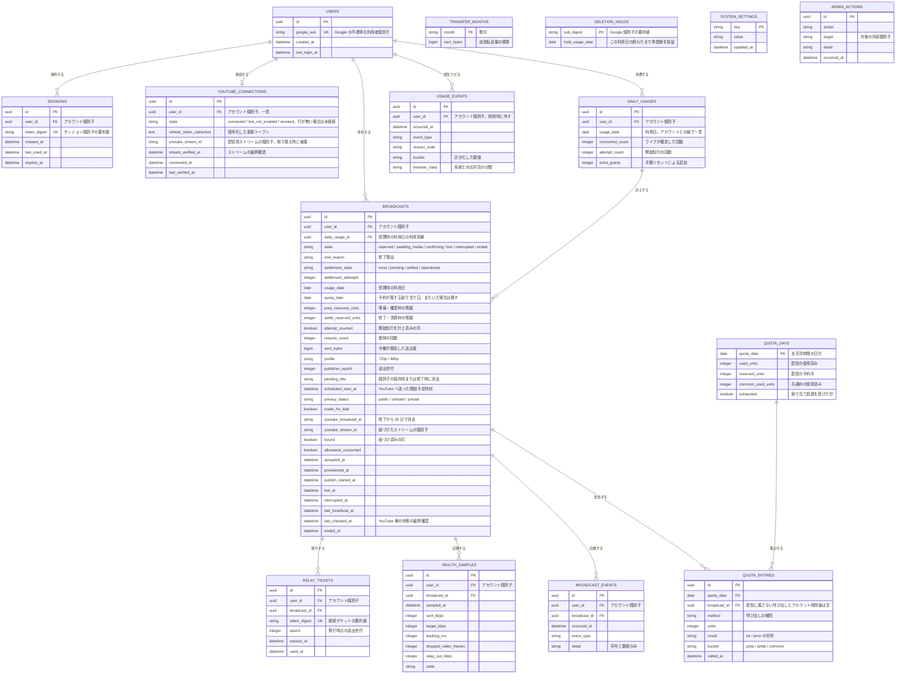
```mermaid
erDiagram
  USERS ||--o{ SESSIONS : "保持する"
  USERS ||--o| YOUTUBE_CONNECTIONS : "接続する"
  USERS ||--o{ BROADCASTS : "所有する"
  USERS ||--o{ DAILY_USAGES : "消費する"
  USERS ||--o{ USAGE_EVENTS : "発生させる"
  DAILY_USAGES ||--o{ BROADCASTS : "計上する"
  BROADCASTS ||--o{ RELAY_TICKETS : "発行する"
  BROADCASTS ||--o{ HEALTH_SAMPLES : "記録する"
  BROADCASTS ||--o{ BROADCAST_EVENTS : "記録する"
  BROADCASTS ||--o{ QUOTA_ENTRIES : "支出する"
  QUOTA_DAYS ||--o{ QUOTA_ENTRIES : "集計する"

  USERS {
    uuid id PK
    string google_sub UK "Google の不透明な利用者識別子"
    datetime created_at
    datetime last_login_at
  }

  SESSIONS {
    uuid id PK
    uuid user_id FK "アカウント識別子"
    string token_digest UK "セッション識別子の要約値"
    datetime created_at
    datetime last_used_at
    datetime expires_at
  }

  YOUTUBE_CONNECTIONS {
    uuid id PK
    uuid user_id FK "アカウント識別子。一意"
    string state "connected / live_not_enabled / revoked。行が無い場合は未接続"
    text refresh_token_ciphertext "暗号化した更新トークン"
    string youtube_stream_id "配信用ストリームの識別子。取り替え時に破棄"
    datetime stream_verified_at "ストリームの最終確認"
    datetime connected_at
    datetime last_verified_at
  }

  BROADCASTS {
    uuid id PK
    uuid user_id FK "アカウント識別子"
    uuid daily_usage_id FK "受理時の利用日の利用実績"
    string state "reserved / awaiting_media / confirming / live / interrupted / ended"
    string end_reason "終了理由"
    string settlement_state "none / pending / settled / abandoned"
    integer settlement_attempts
    date usage_date "受理時の利用日"
    date quota_date "予約が属する割り当て日。またいだ場合は移す"
    integer prep_reserved_units "準備・確認枠の残額"
    integer settle_reserved_units "終了・清算枠の残額"
    boolean attempt_counted "開始試行を計上済みの印"
    integer resume_count "復帰の回数"
    bigint sent_bytes "中継が報告した送出量"
    string profile "720p / 480p"
    integer publisher_epoch "送出世代"
    string pending_title "識別子の保存時または終了時に消去"
    datetime scheduled_start_at "YouTube へ送った開始予定時刻"
    string privacy_status "public / unlisted / private"
    boolean made_for_kids
    string youtube_broadcast_id "終了から 30 日で消去"
    string youtube_stream_id "紐づけたストリームの識別子"
    boolean bound "紐づけ済みの印"
    boolean allowance_consumed
    datetime accepted_at
    datetime provisioned_at
    datetime publish_started_at
    datetime live_at
    datetime interrupted_at
    datetime last_heartbeat_at
    datetime last_checked_at "YouTube 側の状態の最終確認"
    datetime ended_at
  }

  DAILY_USAGES {
    uuid id PK
    uuid user_id FK "アカウント識別子"
    date usage_date "利用日。アカウントとの組で一意"
    integer consumed_count "ライブが確定した回数"
    integer attempt_count "開始試行の回数"
    integer extra_grants "手動リセットによる追加"
  }

  RELAY_TICKETS {
    uuid id PK
    uuid user_id FK "アカウント識別子"
    uuid broadcast_id FK
    string token_digest UK "接続チケットの要約値"
    integer epoch "発行時点の送出世代"
    datetime expires_at
    datetime used_at
  }

  HEALTH_SAMPLES {
    uuid id PK
    uuid user_id FK "アカウント識別子"
    uuid broadcast_id FK
    datetime sampled_at
    integer sent_kbps
    integer target_kbps
    integer backlog_ms
    integer dropped_video_frames
    integer relay_out_kbps
    string state
  }

  BROADCAST_EVENTS {
    uuid id PK
    uuid user_id FK "アカウント識別子"
    uuid broadcast_id FK
    datetime occurred_at
    string event_type
    string detail "符号と数値のみ"
  }

  USAGE_EVENTS {
    uuid id PK
    uuid user_id FK "アカウント識別子。削除時に外す"
    datetime occurred_at
    string event_type
    string reason_code
    string bucket "区分化した数値"
    string browser_class "系統と対応可否の分類"
  }

  QUOTA_DAYS {
    date quota_date PK "太平洋時間の日付"
    integer used_units "配信の使用済み"
    integer reserved_units "配信の予約中"
    integer common_used_units "共通枠の使用済み"
    boolean exhausted "割り当て超過を受けた印"
  }

  TRANSFER_MONTHS {
    string month PK "暦月"
    bigint sent_bytes "送信転送量の積算"
  }

  DELETION_HOLDS {
    string sub_digest PK "Google 識別子の要約値"
    date hold_usage_date "この利用日の終わりまで再登録を保留"
  }

  QUOTA_ENTRIES {
    uuid id PK
    date quota_date FK
    uuid broadcast_id FK "配信に属さない呼び出しとアカウント削除後は空"
    string method "呼び出しの種別"
    integer units
    string result "ok / error の符号"
    string bucket "prep / settle / common"
    datetime called_at
  }

  SYSTEM_SETTINGS {
    string key PK
    string value
    datetime updated_at
  }

  ADMIN_ACTIONS {
    uuid id PK
    string action
    string target "対象の内部識別子"
    string detail
    datetime occurred_at
  }
```

---

## 22. DFD

### 22.1 コンテキストレベル

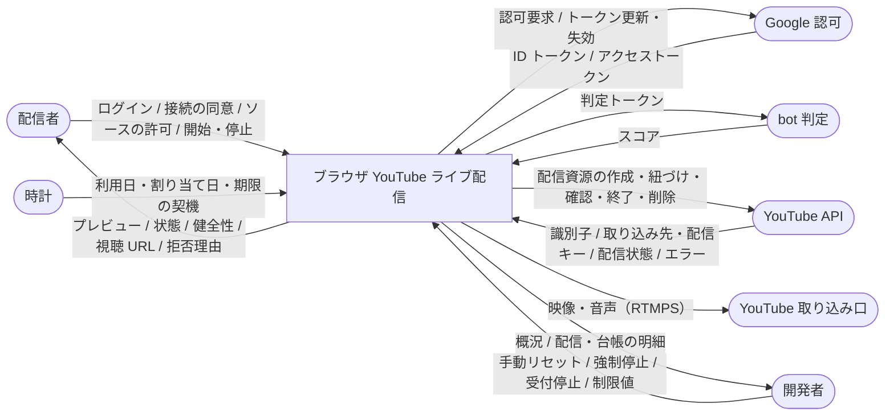
```mermaid
flowchart LR
  BC(["配信者"])
  DEV(["開発者"])
  GID(["Google 認可"])
  BOT(["bot 判定"])
  YAPI(["YouTube API"])
  YING(["YouTube 取り込み口"])
  CK(["時計"])

  P0["ブラウザ YouTube ライブ配信"]

  BC -->|"ログイン / 接続の同意 / ソースの許可 / 開始・停止"| P0
  P0 -->|"プレビュー / 状態 / 健全性 / 視聴 URL / 拒否理由"| BC
  P0 -->|"認可要求 / トークン更新・失効"| GID
  GID -->|"ID トークン / アクセストークン"| P0
  P0 -->|"判定トークン"| BOT
  BOT -->|"スコア"| P0
  P0 -->|"配信資源の作成・紐づけ・確認・終了・削除"| YAPI
  YAPI -->|"識別子 / 取り込み先・配信キー / 配信状態 / エラー"| P0
  P0 -->|"映像・音声（RTMPS）"| YING
  DEV -->|"手動リセット / 強制停止 / 受付停止 / 制限値"| P0
  P0 -->|"概況 / 配信・台帳の明細"| DEV
  CK -->|"利用日・割り当て日・期限の契機"| P0
```

### 22.2 詳細レベル

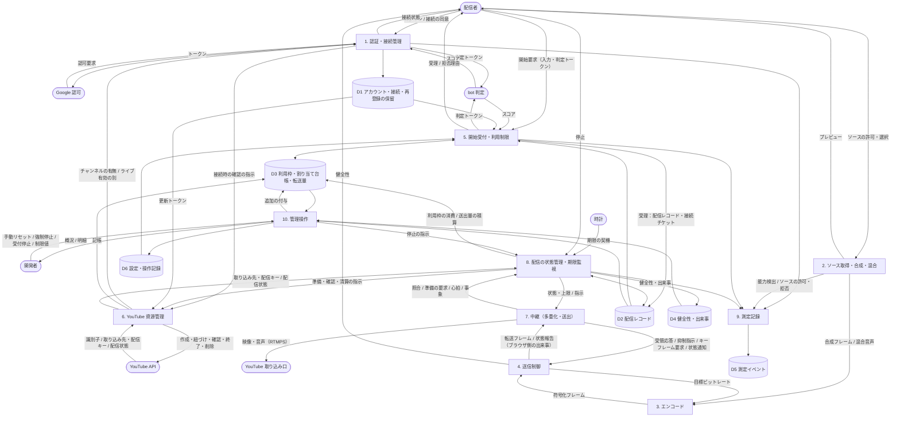
```mermaid
flowchart TB
  BC(["配信者"])
  DEV(["開発者"])
  GID(["Google 認可"])
  BOT(["bot 判定"])
  YAPI(["YouTube API"])
  YING(["YouTube 取り込み口"])
  CK(["時計"])

  P1["1. 認証・接続管理"]
  P2["2. ソース取得・合成・混合"]
  P3["3. エンコード"]
  P4["4. 送信制御"]
  P5["5. 開始受付・利用制限"]
  P6["6. YouTube 資源管理"]
  P7["7. 中継（多重化・送出）"]
  P8["8. 配信の状態管理・期限監視"]
  P9["9. 測定記録"]
  P10["10. 管理操作"]

  D1[("D1 アカウント・接続・再登録の保留")]
  D2[("D2 配信レコード")]
  D3[("D3 利用枠・割り当て台帳・転送量")]
  D4[("D4 健全性・出来事")]
  D5[("D5 測定イベント")]
  D6[("D6 設定・操作記録")]

  BC -->|"ログイン / 接続の同意"| P1
  P1 -->|"認可要求"| GID
  GID -->|"トークン"| P1
  P1 -->|"判定トークン"| BOT
  BOT -->|"スコア"| P1
  P1 -->|"接続時の確認の指示"| P6
  P6 -->|"チャンネルの有無 / ライブ有効の別"| P1
  P1 --> D1
  P1 -->|"接続状態"| BC

  BC -->|"ソースの許可・選択"| P2
  P2 -->|"合成フレーム / 混合音声"| P3
  P3 -->|"符号化フレーム"| P4
  P4 -->|"転送フレーム / 状態報告（ブラウザ側の出来事）"| P7
  P7 -->|"受領応答 / 抑制指示 / キーフレーム要求 / 状態通知"| P4
  P4 -->|"目標ビットレート"| P3
  P2 -->|"プレビュー"| BC
  P4 -->|"健全性"| BC

  BC -->|"開始要求（入力・判定トークン）"| P5
  P5 -->|"判定トークン"| BOT
  BOT -->|"スコア"| P5
  D1 --> P5
  D2 --> P5
  D6 --> P5
  P5 <--> D3
  P5 -->|"受理：配信レコード・接続チケット"| D2
  P5 -->|"受理 / 拒否理由"| BC

  P7 -->|"照合 / 準備の要求 / 心拍 / 事象"| P8
  P8 -->|"状態・上限 / 指示"| P7
  P8 -->|"準備・確認・清算の指示"| P6
  P6 -->|"作成・紐づけ・確認・終了・削除"| YAPI
  YAPI -->|"識別子 / 取り込み先・配信キー / 配信状態"| P6
  P6 -->|"記帳"| D3
  P6 -->|"取り込み先・配信キー / 配信状態"| P8
  D1 -->|"更新トークン"| P6
  P8 <--> D2
  P8 -->|"健全性・出来事"| D4
  P7 -->|"映像・音声（RTMPS）"| YING
  CK -->|"期限の契機"| P8
  BC -->|"停止"| P8
  P8 -->|"利用枠の消費 / 送出量の積算"| D3

  P1 --> P9
  P2 -->|"能力検出 / ソースの許可・拒否"| P9
  P5 --> P9
  P8 --> P9
  P9 --> D5

  DEV -->|"手動リセット / 強制停止 / 受付停止 / 制限値"| P10
  P10 --> D6
  P10 -->|"追加の付与"| D3
  P10 -->|"停止の指示"| P8
  D2 --> P10
  D3 --> P10
  D4 --> P10
  P10 -->|"概況 / 明細"| DEV
```

---

## 23. シーケンス図

HTTP の要求は、すべてフロントエンドの同一オリジン中継を経由してアプリケーションへ届く。以下の図ではこの中継を省略する。

### 23.1 ログインと YouTube 接続

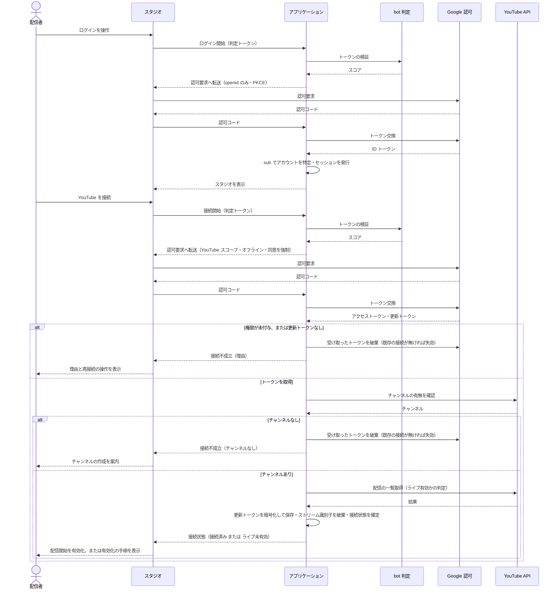
```mermaid
sequenceDiagram
  actor BC as 配信者
  participant ST as スタジオ
  participant AP as アプリケーション
  participant BOT as bot 判定
  participant GID as Google 認可
  participant YA as YouTube API

  BC->>ST: ログインを操作
  ST->>AP: ログイン開始（判定トークン）
  AP->>BOT: トークンの検証
  BOT-->>AP: スコア
  AP-->>ST: 認可要求へ転送（openid のみ・PKCE）
  ST->>GID: 認可要求
  GID-->>ST: 認可コード
  ST->>AP: 認可コード
  AP->>GID: トークン交換
  GID-->>AP: ID トークン
  AP->>AP: sub でアカウントを特定・セッションを発行
  AP-->>ST: スタジオを表示

  BC->>ST: YouTube を接続
  ST->>AP: 接続開始（判定トークン）
  AP->>BOT: トークンの検証
  BOT-->>AP: スコア
  AP-->>ST: 認可要求へ転送（YouTube スコープ・オフライン・同意を強制）
  ST->>GID: 認可要求
  GID-->>ST: 認可コード
  ST->>AP: 認可コード
  AP->>GID: トークン交換
  GID-->>AP: アクセストークン・更新トークン

  alt 権限が未付与、または更新トークンなし
    AP->>GID: 受け取ったトークンを破棄（既存の接続が無ければ失効）
    AP-->>ST: 接続不成立（理由）
    ST-->>BC: 理由と再接続の操作を表示
  else トークンを取得
    AP->>YA: チャンネルの有無を確認
    YA-->>AP: チャンネル
    alt チャンネルなし
      AP->>GID: 受け取ったトークンを破棄（既存の接続が無ければ失効）
      AP-->>ST: 接続不成立（チャンネルなし）
      ST-->>BC: チャンネルの作成を案内
    else チャンネルあり
      AP->>YA: 配信の一覧取得（ライブ有効かの判定）
      YA-->>AP: 結果
      AP->>AP: 更新トークンを暗号化して保存・ストリーム識別子を破棄・接続状態を確定
      AP-->>ST: 接続状態（接続済み または ライブ未有効）
      ST-->>BC: 配信開始を有効化、または有効化の手順を表示
    end
  end
```

### 23.2 配信開始

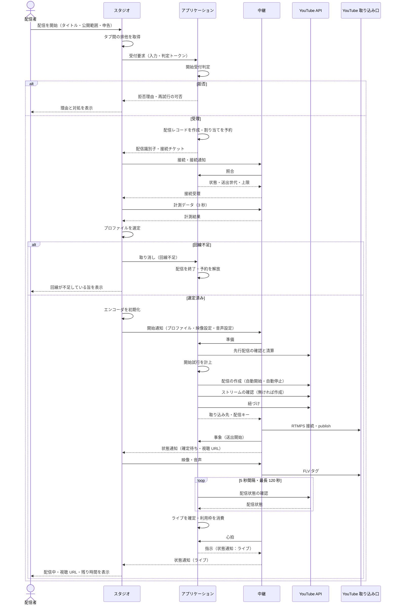
```mermaid
sequenceDiagram
  actor BC as 配信者
  participant ST as スタジオ
  participant AP as アプリケーション
  participant RL as 中継
  participant YA as YouTube API
  participant YI as YouTube 取り込み口

  BC->>ST: 配信を開始（タイトル・公開範囲・申告）
  ST->>ST: タブ間の排他を取得
  ST->>AP: 受付要求（入力・判定トークン）
  AP->>AP: 開始受付判定

  alt 拒否
    AP-->>ST: 拒否理由・再試行の可否
    ST-->>BC: 理由と対処を表示
  else 受理
    AP->>AP: 配信レコードを作成・割り当てを予約
    AP-->>ST: 配信識別子・接続チケット
    ST->>RL: 接続・接続通知
    RL->>AP: 照合
    AP-->>RL: 状態・送出世代・上限
    RL-->>ST: 接続受理
    ST->>RL: 計測データ（3 秒）
    RL-->>ST: 計測結果
    ST->>ST: プロファイルを選定

    alt 回線不足
      ST->>AP: 取り消し（回線不足）
      AP->>AP: 配信を終了・予約を解放
      ST-->>BC: 回線が不足している旨を表示
    else 選定済み
      ST->>ST: エンコーダを初期化
      ST->>RL: 開始通知（プロファイル・映像設定・音声設定）
      RL->>AP: 準備
      AP->>YA: 先行配信の確認と清算
      AP->>AP: 開始試行を計上
      AP->>YA: 配信の作成（自動開始・自動停止）
      AP->>YA: ストリームの確認（無ければ作成）
      AP->>YA: 紐づけ
      AP-->>RL: 取り込み先・配信キー
      RL->>YI: RTMPS 接続・publish
      RL->>AP: 事象（送出開始）
      RL-->>ST: 状態通知（確定待ち・視聴 URL）
      ST->>RL: 映像・音声
      RL->>YI: FLV タグ
      loop 5 秒間隔・最長 120 秒
        AP->>YA: 配信状態の確認
        YA-->>AP: 配信状態
      end
      AP->>AP: ライブを確定・利用枠を消費
      RL->>AP: 心拍
      AP-->>RL: 指示（状態通知：ライブ）
      RL-->>ST: 状態通知（ライブ）
      ST-->>BC: 配信中・視聴 URL・残り時間を表示
    end
  end
```

### 23.3 定常送出と適応

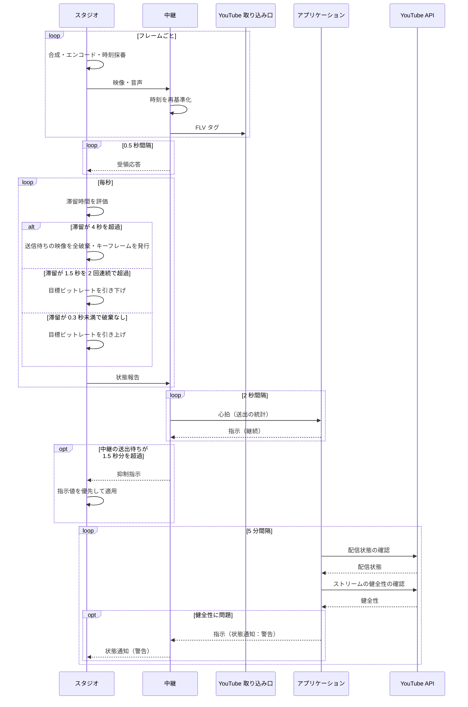
```mermaid
sequenceDiagram
  participant ST as スタジオ
  participant RL as 中継
  participant YI as YouTube 取り込み口
  participant AP as アプリケーション
  participant YA as YouTube API

  loop フレームごと
    ST->>ST: 合成・エンコード・時刻採番
    ST->>RL: 映像・音声
    RL->>RL: 時刻を再基準化
    RL->>YI: FLV タグ
  end

  loop 0.5 秒間隔
    RL-->>ST: 受領応答
  end

  loop 毎秒
    ST->>ST: 滞留時間を評価
    alt 滞留が 4 秒を超過
      ST->>ST: 送信待ちの映像を全破棄・キーフレームを発行
    else 滞留が 1.5 秒を 2 回連続で超過
      ST->>ST: 目標ビットレートを引き下げ
    else 滞留が 0.3 秒未満で破棄なし
      ST->>ST: 目標ビットレートを引き上げ
    end
    ST->>RL: 状態報告
  end

  loop 2 秒間隔
    RL->>AP: 心拍（送出の統計）
    AP-->>RL: 指示（継続）
  end

  opt 中継の送出待ちが 1.5 秒分を超過
    RL-->>ST: 抑制指示
    ST->>ST: 指示値を優先して適用
  end

  loop 5 分間隔
    AP->>YA: 配信状態の確認
    YA-->>AP: 配信状態
    AP->>YA: ストリームの健全性の確認
    YA-->>AP: 健全性
    opt 健全性に問題
      AP-->>RL: 指示（状態通知：警告）
      RL-->>ST: 状態通知（警告）
    end
  end
```

### 23.4 中断からの復帰

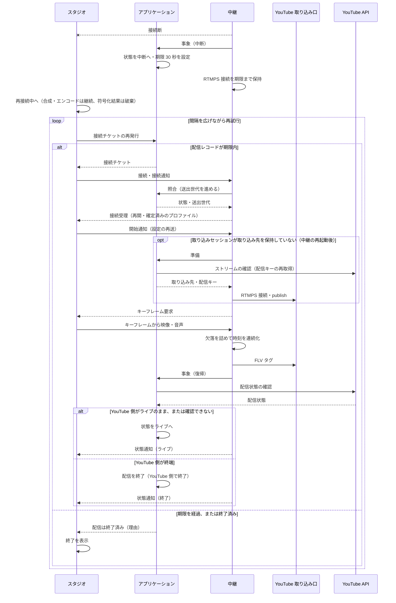
```mermaid
sequenceDiagram
  participant ST as スタジオ
  participant AP as アプリケーション
  participant RL as 中継
  participant YI as YouTube 取り込み口
  participant YA as YouTube API

  RL --x ST: 接続断
  RL->>AP: 事象（中断）
  AP->>AP: 状態を中断へ・期限 30 秒を設定
  RL->>RL: RTMPS 接続を期限まで保持
  ST->>ST: 再接続中へ（合成・エンコードは継続、符号化結果は破棄）

  loop 間隔を広げながら再試行
    ST->>AP: 接続チケットの再発行
    alt 配信レコードが期限内
      AP-->>ST: 接続チケット
      ST->>RL: 接続・接続通知
      RL->>AP: 照合（送出世代を進める）
      AP-->>RL: 状態・送出世代
      RL-->>ST: 接続受理（再開・確定済みのプロファイル）
      ST->>RL: 開始通知（設定の再送）
      opt 取り込みセッションが取り込み先を保持していない（中継の再起動後）
        RL->>AP: 準備
        AP->>YA: ストリームの確認（配信キーの再取得）
        AP-->>RL: 取り込み先・配信キー
        RL->>YI: RTMPS 接続・publish
      end
      RL-->>ST: キーフレーム要求
      ST->>RL: キーフレームから映像・音声
      RL->>RL: 欠落を詰めて時刻を連続化
      RL->>YI: FLV タグ
      RL->>AP: 事象（復帰）
      AP->>YA: 配信状態の確認
      YA-->>AP: 配信状態
      alt YouTube 側がライブのまま、または確認できない
        AP->>AP: 状態をライブへ
        RL-->>ST: 状態通知（ライブ）
      else YouTube 側が終端
        AP->>AP: 配信を終了（YouTube 側で終了）
        RL-->>ST: 状態通知（終了）
      end
    else 期限を経過、または終了済み
      AP-->>ST: 配信は終了済み（理由）
      ST->>ST: 終了を表示
    end
  end
```

### 23.5 停止と清算

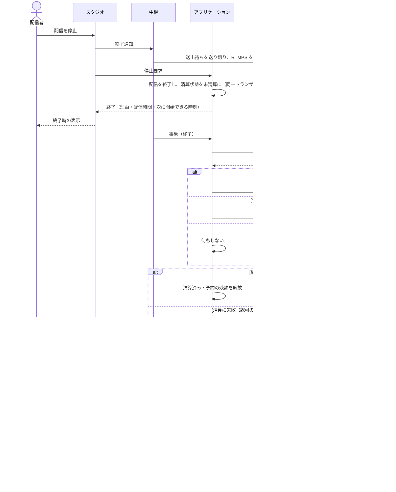
```mermaid
sequenceDiagram
  actor BC as 配信者
  participant ST as スタジオ
  participant RL as 中継
  participant AP as アプリケーション
  participant YI as YouTube 取り込み口
  participant YA as YouTube API

  BC->>ST: 配信を停止
  ST->>RL: 終了通知
  RL->>YI: 送出待ちを送り切り、RTMPS を切断
  ST->>AP: 停止要求
  AP->>AP: 配信を終了し、清算状態を未清算に（同一トランザクション）
  AP-->>ST: 終了（理由・配信時間・次に開始できる時刻）
  ST-->>BC: 終了時の表示
  RL->>AP: 事象（終了）

  AP->>YA: 終了時の状態確認
  YA-->>AP: 配信状態
  alt YouTube 側がライブ
    AP->>YA: 完了へ遷移
  else YouTube 側が未開始
    AP->>YA: 配信を削除
  else YouTube 側が終端
    AP->>AP: 何もしない
  end

  alt 終端に到達
    AP->>AP: 清算済み・予約の残額を解放
  else 清算に失敗（認可の喪失・一時的な失敗）
    loop 1 分・2 分・4 分の間隔で最大 3 回
      AP->>YA: 配信状態の確認
      YA-->>AP: 配信状態
      AP->>YA: 終端でなければ清算
    end
    alt 終端に到達
      AP->>AP: 清算済み・予約の残額を解放
    else 再試行が尽きた
      AP->>AP: 清算不能・予約の残額を解放・ストリーム識別子を破棄
    end
  end
```

### 23.6 タブを閉じた場合の自動終了

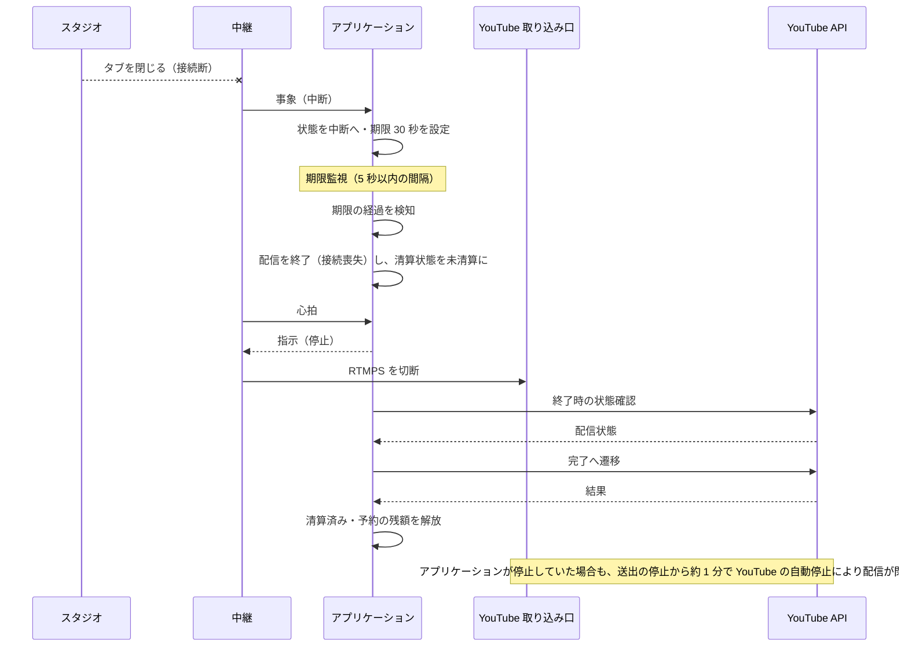
```mermaid
sequenceDiagram
  participant ST as スタジオ
  participant RL as 中継
  participant AP as アプリケーション
  participant YI as YouTube 取り込み口
  participant YA as YouTube API

  ST --x RL: タブを閉じる（接続断）
  RL->>AP: 事象（中断）
  AP->>AP: 状態を中断へ・期限 30 秒を設定

  Note over AP: 期限監視（5 秒以内の間隔）
  AP->>AP: 期限の経過を検知
  AP->>AP: 配信を終了（接続喪失）し、清算状態を未清算に
  RL->>AP: 心拍
  AP-->>RL: 指示（停止）
  RL->>YI: RTMPS を切断
  AP->>YA: 終了時の状態確認
  YA-->>AP: 配信状態
  AP->>YA: 完了へ遷移
  YA-->>AP: 結果
  AP->>AP: 清算済み・予約の残額を解放

  Note over YI,YA: アプリケーションが停止していた場合も、送出の停止から約 1 分で YouTube の自動停止により配信が閉じる
```

---

## 24. クラス図

### 24.1 ブラウザ（配信パイプライン）

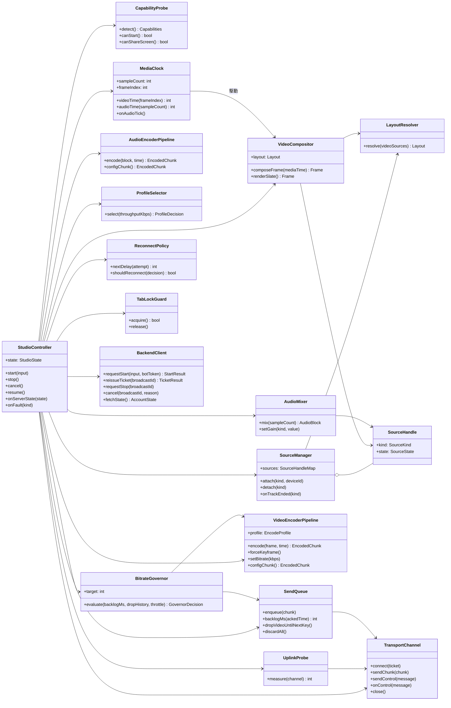
```mermaid
classDiagram
  direction LR

  class StudioController {
    +state: StudioState
    +start(input)
    +stop()
    +cancel()
    +resume()
    +onServerState(state)
    +onFault(kind)
  }
  class CapabilityProbe {
    +detect() Capabilities
    +canStart() bool
    +canShareScreen() bool
  }
  class SourceManager {
    +sources: SourceHandleMap
    +attach(kind, deviceId)
    +detach(kind)
    +onTrackEnded(kind)
  }
  class SourceHandle {
    +kind: SourceKind
    +state: SourceState
  }
  class LayoutResolver {
    +resolve(videoSources) Layout
  }
  class VideoCompositor {
    +layout: Layout
    +composeFrame(mediaTime) Frame
    +renderSlate() Frame
  }
  class AudioMixer {
    +mix(sampleCount) AudioBlock
    +setGain(kind, value)
  }
  class MediaClock {
    +sampleCount: int
    +frameIndex: int
    +videoTime(frameIndex) int
    +audioTime(sampleCount) int
    +onAudioTick()
  }
  class VideoEncoderPipeline {
    +profile: EncodeProfile
    +encode(frame, time) EncodedChunk
    +forceKeyframe()
    +setBitrate(kbps)
    +configChunk() EncodedChunk
  }
  class AudioEncoderPipeline {
    +encode(block, time) EncodedChunk
    +configChunk() EncodedChunk
  }
  class UplinkProbe {
    +measure(channel) int
  }
  class ProfileSelector {
    +select(throughputKbps) ProfileDecision
  }
  class SendQueue {
    +enqueue(chunk)
    +backlogMs(ackedTime) int
    +dropVideoUntilNextKey()
    +discardAll()
  }
  class BitrateGovernor {
    +target: int
    +evaluate(backlogMs, dropHistory, throttle) GovernorDecision
  }
  class TransportChannel {
    +connect(ticket)
    +sendChunk(chunk)
    +sendControl(message)
    +onControl(message)
    +close()
  }
  class ReconnectPolicy {
    +nextDelay(attempt) int
    +shouldReconnect(decision) bool
  }
  class TabLockGuard {
    +acquire() bool
    +release()
  }
  class BackendClient {
    +requestStart(input, botToken) StartResult
    +reissueTicket(broadcastId) TicketResult
    +requestStop(broadcastId)
    +cancel(broadcastId, reason)
    +fetchState() AccountState
  }

  StudioController --> CapabilityProbe
  StudioController --> SourceManager
  StudioController --> MediaClock
  StudioController --> VideoCompositor
  StudioController --> AudioMixer
  StudioController --> VideoEncoderPipeline
  StudioController --> AudioEncoderPipeline
  StudioController --> UplinkProbe
  StudioController --> ProfileSelector
  StudioController --> SendQueue
  StudioController --> BitrateGovernor
  StudioController --> TransportChannel
  StudioController --> ReconnectPolicy
  StudioController --> TabLockGuard
  StudioController --> BackendClient
  SourceManager o-- SourceHandle
  SourceManager --> LayoutResolver
  VideoCompositor --> LayoutResolver
  VideoCompositor --> SourceHandle
  AudioMixer --> SourceHandle
  MediaClock --> VideoCompositor : 駆動
  BitrateGovernor --> SendQueue
  BitrateGovernor --> VideoEncoderPipeline
  UplinkProbe --> TransportChannel
  SendQueue --> TransportChannel
```

### 24.2 アプリケーション

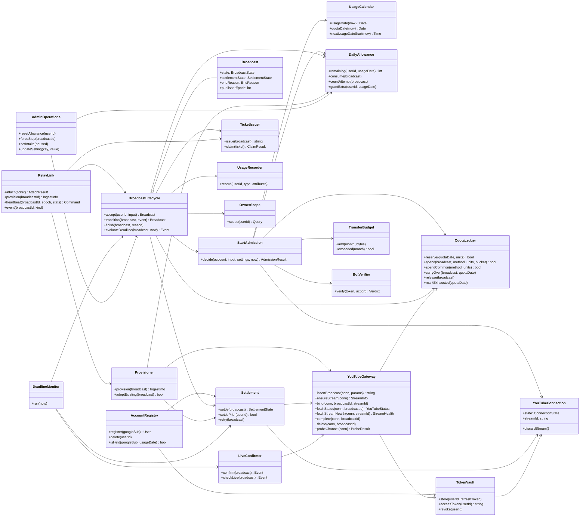
```mermaid
classDiagram
  direction LR

  class StartAdmission {
    +decide(account, input, settings, now) AdmissionResult
  }
  class UsageCalendar {
    +usageDate(now) Date
    +quotaDate(now) Date
    +nextUsageDateStart(now) Time
  }
  class DailyAllowance {
    +remaining(userId, usageDate) int
    +consume(broadcast)
    +countAttempt(broadcast)
    +grantExtra(userId, usageDate)
  }
  class QuotaLedger {
    +reserve(quotaDate, units) bool
    +spend(broadcast, method, units, bucket) bool
    +spendCommon(method, units) bool
    +carryOver(broadcast, quotaDate)
    +release(broadcast)
    +markExhausted(quotaDate)
  }
  class BroadcastLifecycle {
    +accept(userId, input) Broadcast
    +transition(broadcast, event) Broadcast
    +finish(broadcast, reason)
    +evaluateDeadline(broadcast, now) Event
  }
  class Broadcast {
    +state: BroadcastState
    +settlementState: SettlementState
    +endReason: EndReason
    +publisherEpoch: int
  }
  class Provisioner {
    +provision(broadcast) IngestInfo
    +adoptExisting(broadcast) bool
  }
  class Settlement {
    +settle(broadcast) SettlementState
    +settlePrior(userId) bool
    +retry(broadcast)
  }
  class LiveConfirmer {
    +confirm(broadcast) Event
    +checkLive(broadcast) Event
  }
  class YouTubeGateway {
    +insertBroadcast(conn, params) string
    +ensureStream(conn) StreamInfo
    +bind(conn, broadcastId, streamId)
    +fetchStatus(conn, broadcastId) YouTubeStatus
    +fetchStreamHealth(conn, streamId) StreamHealth
    +complete(conn, broadcastId)
    +delete(conn, broadcastId)
    +probeChannel(conn) ProbeResult
  }
  class TokenVault {
    +store(userId, refreshToken)
    +accessToken(userId) string
    +revoke(userId)
  }
  class YouTubeConnection {
    +state: ConnectionState
    +streamId: string
    +discardStream()
  }
  class TransferBudget {
    +add(month, bytes)
    +exceeded(month) bool
  }
  class AccountRegistry {
    +register(googleSub) User
    +delete(userId)
    +isHeld(googleSub, usageDate) bool
  }
  class TicketIssuer {
    +issue(broadcast) string
    +claim(ticket) ClaimResult
  }
  class RelayLink {
    +attach(ticket) AttachResult
    +provision(broadcastId) IngestInfo
    +heartbeat(broadcastId, epoch, stats) Command
    +event(broadcastId, kind)
  }
  class DeadlineMonitor {
    +run(now)
  }
  class BotVerifier {
    +verify(token, action) Verdict
  }
  class UsageRecorder {
    +record(userId, type, attributes)
  }
  class AdminOperations {
    +resetAllowance(userId)
    +forceStop(broadcastId)
    +setIntake(paused)
    +updateSetting(key, value)
  }
  class OwnerScope {
    +scope(userId) Query
  }

  StartAdmission --> UsageCalendar
  StartAdmission --> DailyAllowance
  StartAdmission --> QuotaLedger
  StartAdmission --> BotVerifier
  StartAdmission --> YouTubeConnection
  StartAdmission --> TransferBudget
  Settlement --> YouTubeConnection
  AccountRegistry --> Settlement
  AccountRegistry --> TokenVault
  BroadcastLifecycle --> StartAdmission
  BroadcastLifecycle o-- Broadcast
  BroadcastLifecycle --> Settlement
  BroadcastLifecycle --> DailyAllowance
  BroadcastLifecycle --> QuotaLedger
  BroadcastLifecycle --> TicketIssuer
  BroadcastLifecycle --> UsageRecorder
  BroadcastLifecycle --> OwnerScope
  Provisioner --> Settlement
  Provisioner --> YouTubeGateway
  Provisioner --> DailyAllowance
  Settlement --> YouTubeGateway
  LiveConfirmer --> YouTubeGateway
  YouTubeGateway --> TokenVault
  YouTubeGateway --> QuotaLedger
  TokenVault --> YouTubeConnection
  RelayLink --> TicketIssuer
  RelayLink --> Provisioner
  RelayLink --> BroadcastLifecycle
  DeadlineMonitor --> BroadcastLifecycle
  DeadlineMonitor --> LiveConfirmer
  DeadlineMonitor --> Settlement
  AdminOperations --> DailyAllowance
  AdminOperations --> BroadcastLifecycle
```

### 24.3 中継

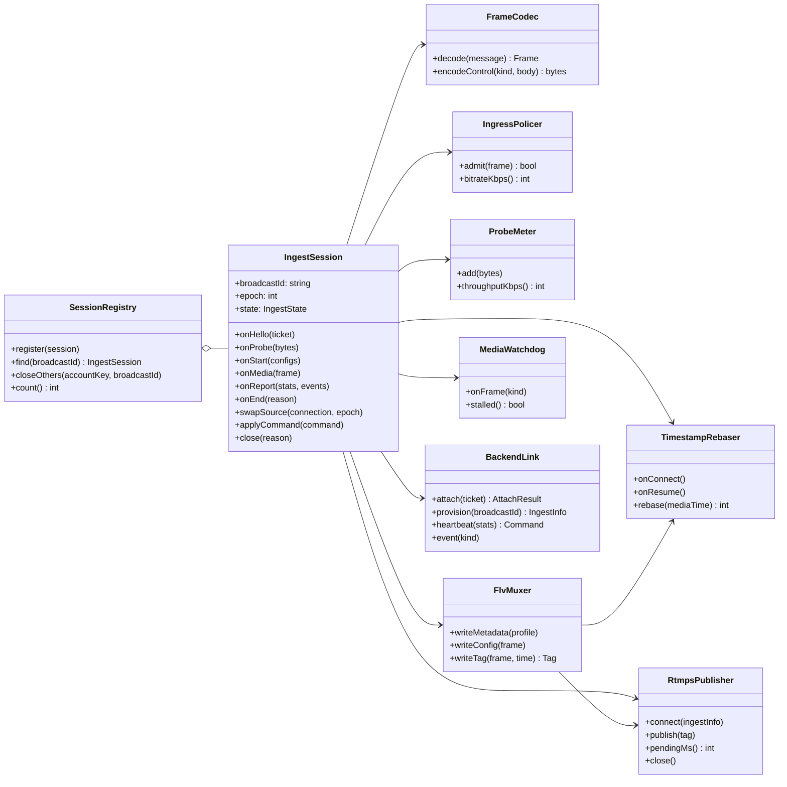
```mermaid
classDiagram
  direction LR

  class IngestSession {
    +broadcastId: string
    +epoch: int
    +state: IngestState
    +onHello(ticket)
    +onProbe(bytes)
    +onStart(configs)
    +onMedia(frame)
    +onReport(stats, events)
    +onEnd(reason)
    +swapSource(connection, epoch)
    +applyCommand(command)
    +close(reason)
  }
  class FrameCodec {
    +decode(message) Frame
    +encodeControl(kind, body) bytes
  }
  class IngressPolicer {
    +admit(frame) bool
    +bitrateKbps() int
  }
  class ProbeMeter {
    +add(bytes)
    +throughputKbps() int
  }
  class FlvMuxer {
    +writeMetadata(profile)
    +writeConfig(frame)
    +writeTag(frame, time) Tag
  }
  class TimestampRebaser {
    +onConnect()
    +onResume()
    +rebase(mediaTime) int
  }
  class RtmpsPublisher {
    +connect(ingestInfo)
    +publish(tag)
    +pendingMs() int
    +close()
  }
  class MediaWatchdog {
    +onFrame(kind)
    +stalled() bool
  }
  class BackendLink {
    +attach(ticket) AttachResult
    +provision(broadcastId) IngestInfo
    +heartbeat(stats) Command
    +event(kind)
  }
  class SessionRegistry {
    +register(session)
    +find(broadcastId) IngestSession
    +closeOthers(accountKey, broadcastId)
    +count() int
  }

  SessionRegistry o-- IngestSession
  IngestSession --> FrameCodec
  IngestSession --> IngressPolicer
  IngestSession --> ProbeMeter
  IngestSession --> FlvMuxer
  IngestSession --> TimestampRebaser
  IngestSession --> RtmpsPublisher
  IngestSession --> MediaWatchdog
  IngestSession --> BackendLink
  FlvMuxer --> TimestampRebaser
  FlvMuxer --> RtmpsPublisher
```

---

## 25. 状態遷移図

### 25.1 配信レコード

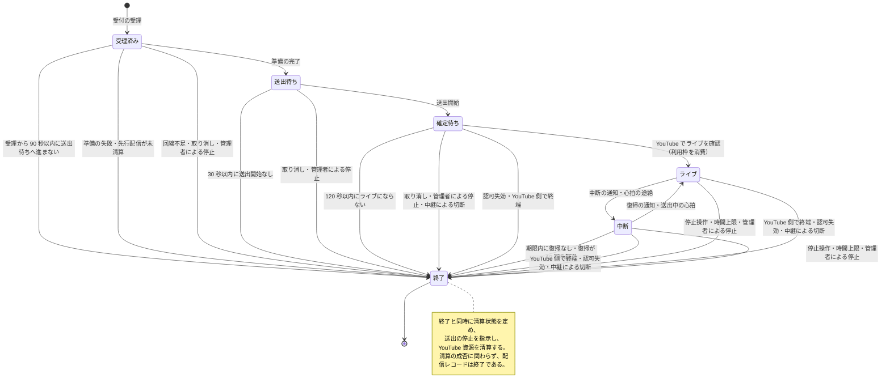
```mermaid
stateDiagram-v2
  state "受理済み" as Reserved
  state "送出待ち" as AwaitingMedia
  state "確定待ち" as Confirming
  state "ライブ" as Live
  state "中断" as Interrupted
  state "終了" as Ended

  [*] --> Reserved : 受付の受理
  Reserved --> AwaitingMedia : 準備の完了
  Reserved --> Ended : 受理から 90 秒以内に送出待ちへ進まない
  Reserved --> Ended : 準備の失敗・先行配信が未清算
  Reserved --> Ended : 回線不足・取り消し・管理者による停止

  AwaitingMedia --> Confirming : 送出開始
  AwaitingMedia --> Ended : 30 秒以内に送出開始なし
  AwaitingMedia --> Ended : 取り消し・管理者による停止

  Confirming --> Live : YouTube でライブを確認（利用枠を消費）
  Confirming --> Ended : 120 秒以内にライブにならない
  Confirming --> Ended : 取り消し・管理者による停止・中継による切断
  Confirming --> Ended : 認可失効・YouTube 側で終端

  Live --> Interrupted : 中断の通知・心拍の途絶
  Interrupted --> Live : 復帰の通知・送出中の心拍
  Interrupted --> Ended : 期限内に復帰なし・復帰が 10 回を超過
  Interrupted --> Ended : YouTube 側で終端・認可失効・中継による切断

  Live --> Ended : 停止操作・時間上限・管理者による停止
  Live --> Ended : YouTube 側で終端・認可失効・中継による切断
  Interrupted --> Ended : 停止操作・時間上限・管理者による停止

  Ended --> [*]

  note right of Ended
    終了と同時に清算状態を定め、
    送出の停止を指示し、YouTube 資源を清算する。
    清算の成否に関わらず、配信レコードは終了である。
  end note
```

### 25.2 清算状態

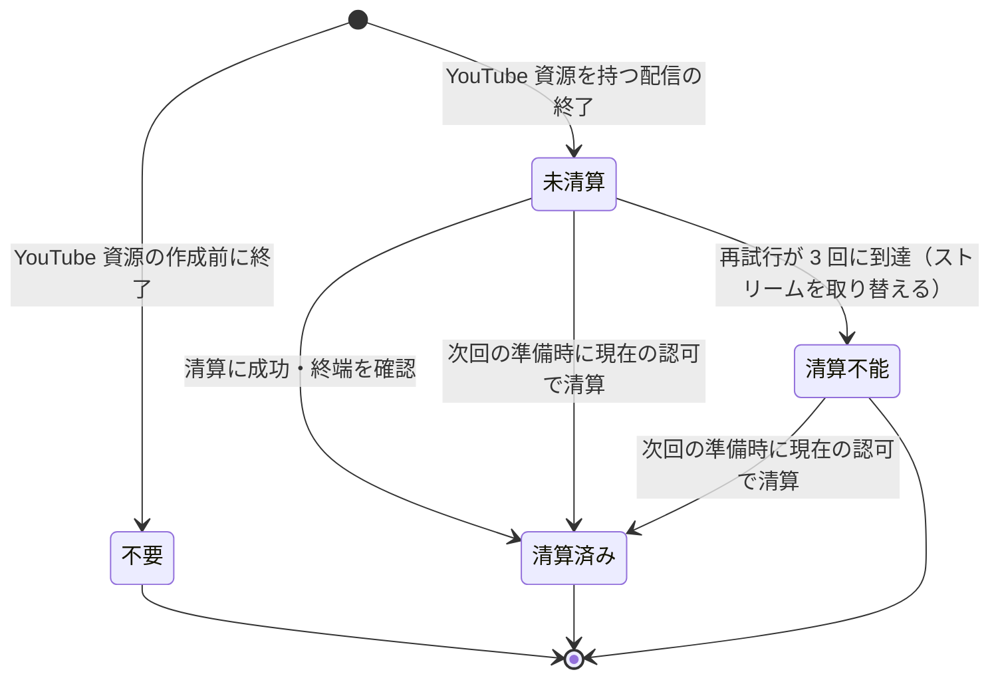
```mermaid
stateDiagram-v2
  state "不要" as NoneNeeded
  state "未清算" as Pending
  state "清算済み" as Settled
  state "清算不能" as Abandoned

  [*] --> NoneNeeded : YouTube 資源の作成前に終了
  [*] --> Pending : YouTube 資源を持つ配信の終了

  Pending --> Settled : 清算に成功・終端を確認
  Pending --> Settled : 次回の準備時に現在の認可で清算
  Pending --> Abandoned : 再試行が 3 回に到達（ストリームを取り替える）
  Abandoned --> Settled : 次回の準備時に現在の認可で清算

  NoneNeeded --> [*]
  Settled --> [*]
  Abandoned --> [*]
```

### 25.3 スタジオ

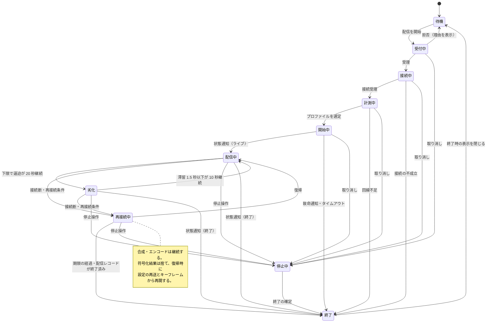
```mermaid
stateDiagram-v2
  state "待機" as Idle
  state "受付中" as Requesting
  state "接続中" as Connecting
  state "計測中" as Probing
  state "開始中" as Starting
  state "配信中" as LiveState
  state "劣化" as Degraded
  state "再接続中" as Reconnecting
  state "停止中" as Stopping
  state "終了" as EndedState

  [*] --> Idle
  Idle --> Requesting : 配信を開始
  Requesting --> Idle : 拒否（理由を表示）
  Requesting --> Connecting : 受理
  Connecting --> Probing : 接続受理
  Connecting --> EndedState : 接続の不成立
  Probing --> Starting : プロファイルを選定
  Probing --> EndedState : 回線不足
  Starting --> LiveState : 状態通知（ライブ）
  Starting --> EndedState : 致命通知・タイムアウト

  LiveState --> Degraded : 下限で逼迫が 20 秒継続
  Degraded --> LiveState : 滞留 1.5 秒以下が 10 秒継続
  LiveState --> Reconnecting : 接続断・再接続条件
  Degraded --> Reconnecting : 接続断・再接続条件
  Reconnecting --> LiveState : 復帰
  Reconnecting --> EndedState : 期限の経過・配信レコードが終了済み

  Requesting --> Stopping : 取り消し
  Connecting --> Stopping : 取り消し
  Probing --> Stopping : 取り消し
  Starting --> Stopping : 取り消し
  LiveState --> Stopping : 停止操作
  Degraded --> Stopping : 停止操作
  Reconnecting --> Stopping : 停止操作
  LiveState --> EndedState : 状態通知（終了）
  Degraded --> EndedState : 状態通知（終了）
  Stopping --> EndedState : 終了の確定
  EndedState --> Idle : 終了時の表示を閉じる

  note right of Reconnecting
    合成・エンコードは継続する。
    符号化結果は捨て、復帰時に
    設定の再送とキーフレームから再開する。
  end note
```

### 25.4 YouTube 接続

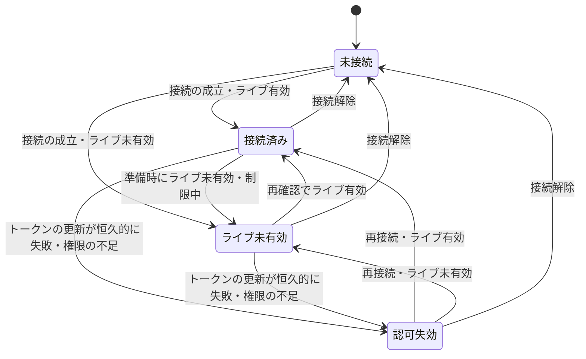
```mermaid
stateDiagram-v2
  state "未接続" as NotConnected
  state "接続済み" as Connected
  state "ライブ未有効" as LiveNotEnabled
  state "認可失効" as Revoked

  [*] --> NotConnected
  NotConnected --> Connected : 接続の成立・ライブ有効
  NotConnected --> LiveNotEnabled : 接続の成立・ライブ未有効
  LiveNotEnabled --> Connected : 再確認でライブ有効
  Connected --> LiveNotEnabled : 準備時にライブ未有効・制限中
  Connected --> Revoked : トークンの更新が恒久的に失敗・権限の不足
  LiveNotEnabled --> Revoked : トークンの更新が恒久的に失敗・権限の不足
  Revoked --> Connected : 再接続・ライブ有効
  Revoked --> LiveNotEnabled : 再接続・ライブ未有効
  Connected --> NotConnected : 接続解除
  LiveNotEnabled --> NotConnected : 接続解除
  Revoked --> NotConnected : 接続解除
```

### 25.5 ソース

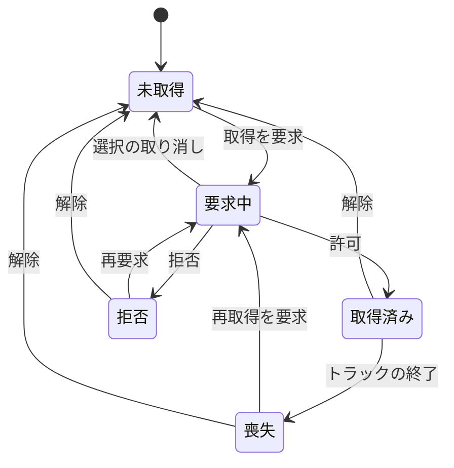
```mermaid
stateDiagram-v2
  state "未取得" as Detached
  state "要求中" as Requesting
  state "取得済み" as Active
  state "拒否" as Denied
  state "喪失" as Lost

  [*] --> Detached
  Detached --> Requesting : 取得を要求
  Requesting --> Active : 許可
  Requesting --> Denied : 拒否
  Requesting --> Detached : 選択の取り消し
  Denied --> Requesting : 再要求
  Active --> Lost : トラックの終了
  Active --> Detached : 解除
  Lost --> Requesting : 再取得を要求
  Lost --> Detached : 解除
  Denied --> Detached : 解除
```

---

## 26. ユースケース図

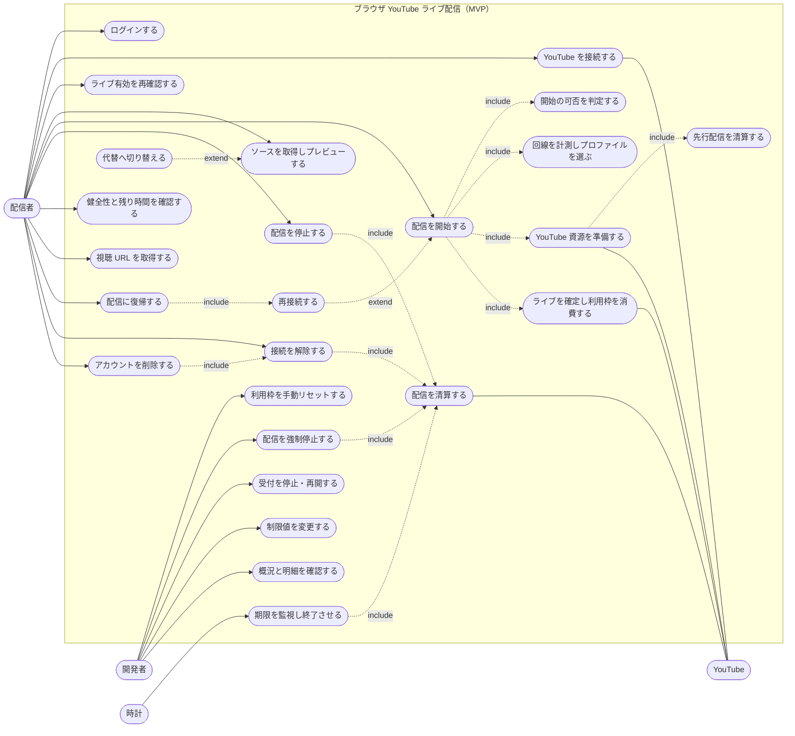
```mermaid
flowchart LR
  BC(["配信者"])
  DEV(["開発者"])
  CK(["時計"])
  YT(["YouTube"])

  subgraph SYS["ブラウザ YouTube ライブ配信（MVP）"]
    U1(["ログインする"])
    U2(["YouTube を接続する"])
    U3(["ライブ有効を再確認する"])
    U4(["ソースを取得しプレビューする"])
    U5(["配信を開始する"])
    U6(["配信を停止する"])
    U7(["健全性と残り時間を確認する"])
    U8(["視聴 URL を取得する"])
    U9(["配信に復帰する"])
    U10(["接続を解除する"])
    U11(["アカウントを削除する"])
    U12(["開始の可否を判定する"])
    U13(["回線を計測しプロファイルを選ぶ"])
    U14(["YouTube 資源を準備する"])
    U15(["先行配信を清算する"])
    U16(["ライブを確定し利用枠を消費する"])
    U17(["再接続する"])
    U18(["代替へ切り替える"])
    U19(["配信を清算する"])
    U20(["期限を監視し終了させる"])
    U21(["利用枠を手動リセットする"])
    U22(["配信を強制停止する"])
    U23(["受付を停止・再開する"])
    U24(["制限値を変更する"])
    U25(["概況と明細を確認する"])
  end

  BC --> U1
  BC --> U2
  BC --> U3
  BC --> U4
  BC --> U5
  BC --> U6
  BC --> U7
  BC --> U8
  BC --> U9
  BC --> U10
  BC --> U11
  DEV --> U21
  DEV --> U22
  DEV --> U23
  DEV --> U24
  DEV --> U25
  CK --> U20

  U5 -.->|"include"| U12
  U5 -.->|"include"| U13
  U5 -.->|"include"| U14
  U14 -.->|"include"| U15
  U5 -.->|"include"| U16
  U17 -.->|"extend"| U5
  U18 -.->|"extend"| U4
  U9 -.->|"include"| U17
  U6 -.->|"include"| U19
  U20 -.->|"include"| U19
  U22 -.->|"include"| U19
  U10 -.->|"include"| U19
  U11 -.->|"include"| U10

  U2 --- YT
  U14 --- YT
  U16 --- YT
  U19 --- YT
```

---

## 27. 非機能要件

| 区分 | 要件 |
|---|---|
| 中継負荷 | 中継層は再エンコードを行わない。処理量は接続数に対して線形に留めること |
| 遅延 | ブラウザから中継までの滞留時間が、配信中に単調増加し続けないこと（12 章の破棄と再接続で上限を持たせる） |
| 継続性 | タブが非表示・最小化された状態でも合成と送出が継続すること |
| 終端性 | すべての配信レコードが、通知の有無に関わらず有限時間で終了へ到達すること |
| 独立性 | メディアの転送は制御面の 60 秒以内の不達で停止しないこと。制御面は中継の不達で停止しないこと |
| 冪等性 | 準備・停止・清算・事象の通知は、同じ要求の重複で結果が変わらないこと |
| 整合性 | 利用枠の判定と割り当ての予約は受理と、開始試行の計上は準備の開始と、利用枠の消費はライブへの遷移と、それぞれ同一のトランザクションで行うこと |
| 資源 | 中継の送出待ちは 3 秒分、ブラウザの送信待ちは 12 章の破棄により上限を持つこと。メディアを永続化しないこと |
| 同時性 | 同時配信数の上限を超える受付を受理しないこと |
| 再現性 | Domain Core の関数は、時刻・設定値・現況を引数として受け取り、同じ入力に同じ出力を返すこと |
| 多利用者 | 複数アカウントの同時利用で、互いの配信・利用枠・記録に影響しないこと |

---

## 28. セキュリティ・個人情報

### 28.1 セキュリティ

| 対象 | 要件 |
|---|---|
| 認証 | Google ログイン（認可コードフロー ＋ PKCE）。state と nonce を検証する |
| セッション | サーバー側に保持する。Cookie は HttpOnly・Secure・SameSite=Lax。状態を変える要求には CSRF 対策を課す |
| bot 対策 | reCAPTCHA を、ログイン開始・YouTube 接続開始・配信の開始要求に課す。サーバー側で行為名・発行元・スコアを検証し、判定不能は拒否とする |
| 頻度制限 | ログイン・接続の開始は IP 単位で 30 回 / 時、再確認はアカウント単位で 1 回 / 分、受付の要求はアカウント単位で 10 回 / 時（設定値）とする。計数はアプリケーションのプロセス内に保持する |
| フロントエンドとの間 | アプリケーションは、フロントエンドからの要求であることを共有の秘密値で確認する。利用者の IP アドレスは、この確認を通った要求の転送ヘッダからのみ読み取る |
| 更新トークン | 暗号化して保存し、鍵は環境変数で外部化する。ブラウザ・中継・ログ・管理画面へ出力しない |
| 配信キー | 保存しない。アプリケーションから中継へ内部通信でのみ渡し、中継はメモリにのみ保持する |
| 中継への接続 | 短命・1 回限りの接続チケットで認可する。最新の送出世代のみ送出できる |
| 中継の受信 | 長さ・種別・時刻の整合を検証し、逸脱するメッセージは破棄する。大きさと実効ビットレートに上限を課す |
| 送出先 | YouTube の取り込み口であることを確認した RTMPS の宛先に限る。利用者が宛先を指定する手段を持たない |
| 内部通信 | 公開側の受け口と分け、外部から到達できない経路でのみ受け付ける。共有の秘密値で相互に確認する |
| 管理画面 | BASIC 認証。認証情報は環境変数で外部化する |
| 所有権 | 利用者に属する全レコードをアカウント識別子で絞り込み、他アカウントのレコードを参照・操作できないこと |
| 資格情報 | リポジトリに資格情報を置かない。必要な環境変数名のみを記載する |

### 28.2 個人情報

| 項目 | 扱い |
|---|---|
| メールアドレス | 取得しない（スコープを要求しない） |
| 氏名・表示名・プロフィール画像 | 取得しない（スコープを要求しない） |
| Google の利用者識別子（`sub`） | 不透明な識別子として保持する |
| チャンネル名 | アカウント画面での表示のために取得し、最長 10 分間メモリに保持する。永続化しない |
| タイトル | YouTube の配信識別子の保存、または配信レコードの終了までの間のみ保持する |
| 生年月日・住所・電話番号 | 使用しない |
| 映像・音声 | 保存しない。中継のメモリ上を通過するのみとする |
| IP アドレス | 頻度制限の計数にのみ用い、測定イベント・配信レコードへ記録しない |
| YouTube の配信識別子 | 清算と利用者への案内のために保持し、終了から 30 日で消去する |
| 削除したアカウントの Google 識別子の要約値 | 再登録の保留にのみ用い、削除時点の利用日の終わりに消去する |

- 氏名・メールアドレスと、配信の記録・測定イベントを紐づける設計を持たない
- 利用者は、アカウント画面から接続解除とアカウント削除を自ら行える。Google のセキュリティ設定から権限を取り消せる旨を、プライバシーポリシーとアカウント画面に示す

---

## 29. 運用要件

### 29.1 デプロイ

| 対象 | デプロイ先 | 備考 |
|---|---|---|
| フロントエンド | Vercel（無料） | Hobby プランは非商用・個人利用に限られるため、課金・収益化の機能を持たない |
| アプリケーション・管理画面 | Railway（無料） | 定期処理をアプリケーションのプロセス内で実行し、追加のサービスを持たない |
| 中継 | Railway（無料） | 1 レプリカ |
| PostgreSQL | Railway（無料） | アプリケーションのみが接続する |

### 29.2 無料枠の方針

- **無料枠の枯渇時はサービスを停止し、課金へ移行しない。** 支払い方法を登録しない状態で運用する
- Railway の無料プランの利用枠（月 1 ドル）は、計算資源と送信転送量の従量で消費される。月 1 ドルは RAM 0.1 GB を 1 か月稼働させる額に相当し、3 つのサービス（アプリケーション・中継・PostgreSQL）を常時稼働させる量ではない。**本構成が無料枠の範囲で提供できる稼働時間と配信量は、月の一部に限られる**
- 中継の送信転送量は「（映像ビットレート ＋ 音声ビットレート）× 配信時間」で見積もる。標準プロファイルの初期値（4,628 kbps）で 60 分の配信はおよそ 2.1 GB、軽量プロファイルの初期値（1,628 kbps）ではおよそ 0.7 GB である
- 月次の送信転送量の予算（既定 10 GB）は、転送量による消費を 0.5 ドル相当に留めるための受付の目安であり、標準プロファイルの 60 分配信で 4 本、軽量プロファイルで 13 本に相当する。予算に達した月は新規の受付を拒否し、ログイン・管理画面・進行中の配信の終了処理に用いる資源を残す
- 待機時の計算資源の消費を抑えるため、デプロイ先が提供する場合は、要求の無い時間帯にサービスを休止させる設定を用いる。休止からの復帰に時間を要する場合がある
- 期限監視は、進行中または未清算の配信が無い間は停止してよい。アプリケーションの起動時（休止からの復帰を含む）に全件を評価し、進行中または未清算の配信がある間は休止させない
- サービスが停止した場合、進行中の配信は YouTube の自動停止により閉じる。停止中に終了した配信の清算は、再開後の期限監視と次回の準備時の清算確認で行う
- 需要検証に必要な配信量が上記を超える場合は、制限値ではなくデプロイ先の利用枠が律速となる

### 29.3 定期処理

| 処理 | 間隔 | 内容 |
|---|---|---|
| 期限監視 | 5 秒以内（進行中または未清算の配信がある間） | 配信レコードの期限の評価、ライブ確定の確認、ライブ中の定期確認、清算の再試行 |
| 保持期間の適用 | 1 日（休止していた場合は起動時） | 20.3 の消去・削除（再登録の保留の消去、ストリームの取り替えを含む） |
| 利用枠のリセット | なし | 利用日の算出規則で成立するため、処理を持たない |
| 割り当てのリセット | なし | 割り当て日の算出規則で成立するため、処理を持たない |

### 29.4 環境変数

資格情報と環境依存の値は環境変数で外部化する。リポジトリには変数名のみを記載する。

| 変数名 | 用途 | 層 |
|---|---|---|
| `GOOGLE_CLIENT_ID` / `GOOGLE_CLIENT_SECRET` | Google の OAuth クライアント | アプリケーション |
| `TOKEN_ENCRYPTION_KEY` | 更新トークンの暗号鍵 | アプリケーション |
| `SESSION_SECRET` | セッションの署名鍵 | アプリケーション |
| `RECAPTCHA_SITE_KEY` | bot 判定のサイトキー | フロントエンド |
| `RECAPTCHA_SECRET_KEY` | bot 判定の検証 | アプリケーション |
| `RELAY_SHARED_SECRET` | 内部通信の相互確認 | アプリケーション・中継 |
| `BFF_SHARED_SECRET` | フロントエンドからの要求の確認 | フロントエンド・アプリケーション |
| `ADMIN_BASIC_USER` / `ADMIN_BASIC_PASSWORD` | 管理画面の BASIC 認証 | アプリケーション |
| `DATABASE_URL` | PostgreSQL の接続先 | アプリケーション |
| `BACKEND_ORIGIN` | 同一オリジン中継の転送先 | フロントエンド |
| `BACKEND_INTERNAL_URL` | 内部通信の接続先 | 中継 |
| `RELAY_PUBLIC_URL` | ブラウザへ返す中継の接続先 | アプリケーション |

### 29.5 保守・監視

| 項目 | 内容 |
|---|---|
| 保守 | 行わない。リリース後の不具合対応・機能改修の体制を持たない |
| 監視 | 行わない。死活監視・アラート通知を持たない |
| 手動の運用操作 | 管理画面の操作（19 章）に限る |

---

## 30. 対応環境と制約

### 30.1 必須能力

対応の可否は、ブラウザの名称や版ではなく、起動時の能力検出の結果のみで決める。

| 能力 | 用途 | 欠ける場合 |
|---|---|---|
| H.264 の映像エンコード（プロファイルの設定が利用可能） | 映像の符号化 | 配信の開始を提供しない |
| AAC-LC の音声エンコード（44.1 kHz・2 ch が利用可能） | 音声の符号化 | 配信の開始を提供しない |
| ワーカー上でのフレーム取得と描画 | 表示状態に依存しない合成 | 配信の開始を提供しない |
| 音声の処理周期での信号取得 | メディアクロック・音声の取得 | 配信の開始を提供しない |
| WebSocket | 中継への転送 | 配信の開始を提供しない |
| 画面共有 API | 画面共有・共有音声 | 画面共有の操作のみを提供しない |
| タブ間の排他 | 二重開始の防止 | サーバー側の排他のみで運用する |

### 30.2 対応端末

| 項目 | 内容 |
|---|---|
| 保証する環境 | デスクトップ向けの Chrome・Edge の最新版 |
| その他の環境 | 能力検出を通過した場合は利用できるが、動作を保証しない |
| モバイル | 保証しない。画面共有 API が提供されず、画面の消灯・アプリの切り替えで取得が止まるためである |

### 30.3 利用者側の前提

- YouTube チャンネルを持ち、ライブ配信が有効になっていること（有効化には YouTube 側でのチャンネルの確認を要し、時間を要する場合がある）
- YouTube の利用条件（配信者の年齢要件を含む）を満たすこと
- 上り回線の実効スループットが 1,200 kbps 以上であること

### 30.4 制約

| 制約 | 内容 |
|---|---|
| 配信の回数 | アカウントごとに 1 日 1 回（JST 03:00 区切り） |
| 配信の長さ | 1 配信 60 分まで |
| 同時配信 | システム全体で 3 本まで |
| 1 日の開始数 | YouTube API の割り当てにより、システム全体で上限を持つ（8.4） |
| 月あたりの配信量 | 送信転送量の予算（既定 10 GB）に達した月は、新規の受付を行わない（29.2） |
| 中断の許容 | 30 秒を超える中断から同じ配信へは復帰できない。復帰は 1 配信につき 10 回まで |
| 画質 | 配信中の解像度の変更は行わない。開始後に回線が下限を下回った場合は、劣化の表示のうえ継続し、映像が届かない状態が続けば終了する |
| 認可を失った場合 | 未開始のまま残った YouTube 側の配信を清算できない場合がある。以後の配信は新しいストリームを用いるため影響を受けないが、YouTube 側には予定配信として残る |
| アカウントの削除後 | 同じ Google アカウントでの再登録は、次の利用日から可能となる |

---

## 31. 公開の前提条件

実際の利用者に公開するために、実装とは別に満たすべき条件を示す。

| 条件 | 内容 |
|---|---|
| OAuth 同意画面の公開ステータス | 本番とする。テスト状態では同意が 7 日で失効し、継続利用の計測が成立しない |
| 機微スコープの審査 | YouTube のスコープは審査の対象である。未審査のまま公開した場合、新規の利用者は累計 100 人までに制限され、同意時に未審査の警告が表示される。需要検証の規模がこれを超える場合は、公開前に審査を完了させる |
| 審査に要する資料 | 公開された利用規約・プライバシーポリシー、所有を確認したドメイン、スコープの用途の説明 |
| 利用規約の記載 | 利用者が YouTube 利用規約に同意する旨と、そのリンク |
| プライバシーポリシーの記載 | YouTube API サービスを利用する旨、Google プライバシーポリシーへのリンク、取得する情報・用途・保持期間・削除方法、Google のセキュリティ設定から権限を取り消せる旨とそのリンク |
| 認可データの保持 | YouTube から得たデータを 30 日を超えて保持する場合は更新し、更新しないものは消去する。削除の要求には 7 日以内に応じる（20.3・7.4） |
| YouTube API の割り当て | 既定の割り当てで運用する。割り当ての拡大には YouTube の準拠監査を要する |
| bot 判定のキー | 公開ドメインに対して発行したキーを用いる |
